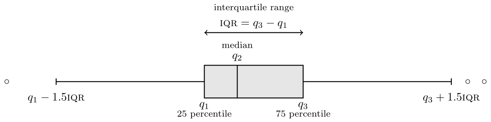

# Completely randomized designs {#CRT}

This chapter focuses on experiments where potentially multiple factors of interest are manipulated by the experimenter to study their impact. If the allocation of observational units to each treatment combination is completely random, the resulting experiment is a completely randomized design.

The one-way analysis of variance describes the most simple experimental setup one can consider: completely randomized experiments with one factor, in which we are solely interested in the effect of a single treatment variable with multiple levels. 


## One-way analysis of variance 


The focus is on comparisons of the average of a single outcome variable with $K$ different treatments levels, each defining a sub-population differing only in the experimental condition they received. A **one-way analysis of variance** compares the sample averages of each treatment group $T_1, \ldots, T_K$ to try and determine if the population averages could be the same. Since we have $K$ groups, there will be $K$ averages (one per group) to estimate. 

Let $\mu_1, \ldots, \mu_K$ denote the theoretical (unknown) mean (aka expectation) of each of the $K$ sub-populations defined by the different treatments. Lack of difference between treatments is equivalent to equality of means, which translates into the hypotheses
\begin{align*}
\mathscr{H}_0: & \mu_1 = \cdots = \mu_K \\
\mathscr{H}_a: & \text{at least two treatments have different averages, }
\end{align*}
The null hypothesis is, as usual, a single numerical value, $\mu$. The alternative consists of all potential scenarios for which not all expectations are equal. Going from $K$ averages to one requires imposing $K-1$ restrictions (the number of equality signs), as the value of the global mean $\mu$ is left unspecified. 


### Parametrizations and contrasts

This section can be skipped on first reading. It focuses on the interpretation of the coefficients obtained from a linear model or analysis of variance model.

The most natural parametrization is in terms of group averages: the (theoretical unknown) average for treatment $T_j$ is $\mu_j$, so we obtain $K$ parameters $\mu_1, \ldots, \mu_K$ whose estimates are the sample averages $\widehat{\mu}_1, \ldots, \widehat{\mu}_K$. One slight complication arising from the above is that the values of the population average are unknown, so this formulation is ill-suited for hypothesis testing because none of the $\mu_i$ values are known in practice and we need to make comparisons in terms of a known numerical value. 

The most common parametrization for the linear model is in terms of **differences to a baseline**, say $T_1$. The theoretical average of each group is written as $\mu_1 + a_i$ for treatment $T_i$, where $a_1=0$ for $T_1$ and $a_i = \mu_i-\mu_1$ otherwise. The parameters are $\mu_1, a_2, \ldots, a_K$.

An equivalent formulation writes for each treatment group the average of subpopulation $j$ as $\mu_j = \mu + \delta_j$, where $\delta_j$ is the difference between the treatment average $\mu_j$ and the global average of all groups. Imposing the constraint $\delta_1 + \cdots + \delta_K=0$ ensures that the average of effects equals $\mu$. Thus, if we know any $K-1$ of $\{\delta_1, \ldots, \delta_K\}$, we automatically can deduce the last one. 

:::{ .example name="Impact of encouragement on teaching"}

In **R**, the `lm` function fits a linear model based on a formula of the form `response ~ explanatory`. If the explanatory is categorical (i.e., a factor), the parameters of this model are the intercept, which is the sample average of the baseline group and the other parameters are simply contrasts, i.e., the $a_i$'s.

The sum-to-zero parametrization is obtained with `contrasts = list(... = contr.sum)`, where the ellipsis is replaced by the name of the categorical variable; an easier alternative is `aov`, which enforces this parametrization by default. With the sum-to-zero parametrization, the intercept is the average of each treatment average, $(\widehat{\mu}_1 + \cdots + \widehat{\mu}_5)/5$; this need not coincide with the (overall) mean of the response $\widehat{\mu} = \overline{y}$ unless the sample the number of observations in each group is the same.^[We say a sample is balanced if each (sub)group contains the same number of observations.] The other coefficients of the sum-to-zero parametrization are the differences between this intercept and the group means. 


We show the function call to fit a one-way ANOVA in the different parametrizations along with the sample average of each arithmetic group (the two controls who were taught separately and the groups that were praised, reproved and ignored in the third class). Note that the omitted category changes depending on the parametrization.

```{r arithmeticLoadData, eval = TRUE, echo = FALSE, cache = FALSE, message = FALSE, error = FALSE}
data(arithmetic, package = "SMPracticals")
arithmetic <- arithmetic |>
  rename(score = y) |>
  mutate(group = factor(group,  
                        levels = LETTERS[1:5], 
                        labels = c("control 1",
                                   "control 2",
                                   "praised",
                                   "reproved",
                                   "ignored")))
summary_stats <- 
  arithmetic %>% 
  group_by(group) %>%
  summarize(mean = mean(score),
            ng = n(), # sample size in each group
            se = sd(score)/sqrt(ng),
            lower = mean - qt(0.975, df = ng - 1)*se, 
            upper = mean + qt(0.975, df = ng - 1)*se)
```

```{r arithmeticParam, eval = TRUE, echo = TRUE, cache = TRUE}
mod_contrast <- lm(score ~ group, 
                   data = arithmetic)
mod_sum2zero <- lm(score ~ group, 
                   data = arithmetic,
                   contrasts = list(group = contr.sum))
```

```{r tableanovaparam, echo = FALSE, eval = TRUE}
summary_stats <- summary_stats %>% 
  add_row(tibble(group = factor("intercept"), 
                 mean = NA), .before = 1) %>%
   select(group, mean) |>
  add_column(contrasts = c(coef(mod_contrast)[1], NA, coef(mod_contrast)[-1]),
             "sum-to-zero" = c(coef(mod_sum2zero), NA))
options(knitr.kable.NA = '')

knitr::kable(summary_stats,
  digits = c(0,2,2,2),
  caption = "Coefficients of the analysis of variance model for the arithmetic scores using different parametrizations.")
```

:::


We can still assess the hypothesis by comparing the sample means in each group, which are noisy estimates of the population mean: their inherent variability will limit our ability to detect differences in averages if the signal-to-noise ratio is small.

```{r samplevar2, eval = FALSE, echo = FALSE, fig.cap = "Three samples from hypothetical populations with a common variance, but different means."}
set.seed(1234)
samp <- data.frame(dat = rep(c(2,10,5), each = 10) +  rt(n = 30, df = 4),
                   group = factor(rep(1:3, each = 10L)))
ggplot(data = samp,
       aes(x = group, y = dat, col = group)) +
  geom_point() +
  geom_jitter() +
  labs(col = "sample", y = "observations", x = "sample number") +
  theme(legend.position = "none") +
  stat_summary(fun = mean,
               geom = "point",
               shape = 95,
               size = 20)
```


### Sum of squares decomposition


The following section can be safely skipped on first reading: it attempts to shed some light into how the $F$-test statistic works as a summary of evidence, as it isn't straightforward in the way it appears. 


The usual notation for the sum of squares decomposition is as follows: suppose $y_{ik}$ represents the $i$th person in the $k$th treatment group ($k=1, \ldots, K$) and the sample size $n$ can be split between groups as $n_1, \ldots, n_K$; in the case of a balanced sample, $n_1=\cdots=n_K = n/K$ and the number of observations in each group is the same. We denote by $\widehat{\mu}_k$ the sample average in group $k$ and $\widehat{\mu}$ the overall average $(y_{11} + \cdots + y_{n_KK})/n = \sum_k  \sum_i y_{ik}/n$, where $\sum_i$ denotes the sum over all individuals in the group. 

Under the null model, all groups have the same mean, so the natural estimator for the latter is the sample average of the pooled sample $\widehat{\mu}$ and likewise the group averages $\widehat{\mu}_1, \ldots, \widehat{\mu}_K$ are the best estimators for the group averages if each group has a (potentially) different mean. The more complex model, which has more parameters, will always fit better because it has more possibility to accommodate differences observed in a group, even if these are spurious.
The sum of squares measures the (squared) distance between the observation and the fitted values, with the terminology total, within and between sum of squares linked to the decomposition
\begin{align*}
\underset{\text{total sum of squares} }{\sum_{i}\sum_{k} (y_{ik} - \widehat{\mu})^2} &= \underset{\text{within sum of squares} }{\sum_i \sum_k (y_{ik} - \widehat{\mu}_k)^2} +  \underset{\text{between sum of squares} }{\sum_k n_i (\widehat{\mu}_k - \widehat{\mu})^2}.
\end{align*}
The term on the left is a measure of the variability for the null model $(\mu_1 = \cdots = \mu_K)$ under which all observations are predicted by the overall average $\widehat{\mu}$. The within sum of squares measures the distance between observations and their group mean, which describes the alternative model in which each group has (potentially) a different average, but the same variability. 

We can measure how much worst we do with the alternative model (different average per group) relative to the null by calculating the between sum of square. This quantity in itself varies with the sample size (the more observations, the larger it is) so we must standardize as usual this quantity so that we have a suitable benchmark. 

The $F$-statistic is 
\begin{align}
F &= \frac{\text{between-group variability}}{\text{within-group variability}} \\&= \frac{\text{between sum of squares}/(K-1)}{\text{within sum of squares}/(n-K)}
(\#eq:Fstatheuristic)
\end{align}

If there is no mean difference (null hypothesis), the numerator is an estimator of the population variance, and so is the denominator of eq. \@ref(eq:Fstatheuristic) and the ratio of the two is approximately 1 on average. However, the between sum of square is more variable and this induces skewness: for large enough sample, the null distribution of the _F_-statistic is approximately an _F_-distribution, whose shape is governed by two parameters named degrees of freedom which appear in eq. \@ref(eq:Fstatheuristic) as scaling factors to ensure proper standardization. The first degree of freedom is the number of restrictions imposed by the null hypothesis ($K-1$, the number of groups minus one for the one-way analysis of variance), and the second degree of freedom is the number of observations minus the number of *parameters estimates* for the mean ($n-K$, where $n$ is the overall sample size and $K$ is the number of groups).^[There are only $K$ parameter estimates for the mean, since the overall mean is full determined by the other averages with $n\widehat{\mu} =n_1\widehat{\mu}_1 + \cdots + n_K \widehat{\mu}_K$.]

Figure \@ref(fig:squareddistanova) shows how the difference between these distances can encompass information that the null is wrong. The sum of squares is obtained by computing the squared length of these vectors and adding them up. The left panel shows strong signal-to-noise ratio, so that, on average, the black segments are much longer than the colored ones. This indicates that the model obtained by letting each group have its own mean is much better than the other. The picture in the right panel is not as clear: on average, the colored arrows are shorter, but the difference in length is much smaller relative to the colored arrows.

```{r squareddistanova, eval = TRUE, echo = FALSE, fig.cap = "Observations drawn from three groups from a model with a strong (left) and weak (right) signal-to-noise ratio, along with their sample mean (colored horizontal segments) and the overall average (horizontal line). Arrows indicate the magnitude of the difference between the observation and the (group/average) mean."}
set.seed(11234)
nobs <- 5
ng <- 3L
dat <- tibble(x = 1:(nobs*ng),
  observations = rnorm(ng*nobs, mean = 10, sd = 0.5) + 
                 rep(rnorm(n = ng, mean = 3), each = nobs),
  group = factor(x = rep(1:ng, each = nobs), 
                 labels = letters[1:ng]))
dat$fitted <- fitted(lm(observations ~ group, data = dat))
group_means <- dat %>%
  group_by(group) %>%
  summarise(gmean = mean(observations)) %>%
  mutate(x = 1 + (1:ng - 1)*nobs,
         xend = nobs + (1:ng - 1)*nobs)


dat2 <- tibble(x = 1:(nobs*ng),
  observations = rnorm(ng*nobs, mean = 10, sd = 8) + 
                 rep(rnorm(n = ng, mean = 0), each = nobs),
  group = factor(x = rep(1:ng, each = nobs), 
                 labels = letters[1:ng]))
dat2$fitted <- fitted(lm(observations ~ group, data = dat2))
group_means2 <- dat2 %>%
  group_by(group) %>%
  summarise(gmean = mean(observations)) %>%
  mutate(x = 1 + (1:ng - 1)*nobs,
         xend = nobs + (1:ng - 1)*nobs)

g1 <- ggplot() +
  geom_hline(yintercept = mean(dat$observations)) + 
  geom_segment(data = group_means, 
               aes(x = x, xend = xend, 
                   y = gmean, yend = gmean, 
                   col = group),
               lwd = 2) + 
  geom_segment(data = dat, 
               aes(x = x+0.1, 
                   xend = x+0.1, 
                   yend = mean(observations), 
                   y = observations),
               arrow = arrow(length =  unit(5,"pt"))) +
  geom_segment(data = dat, 
               aes(x = x - 0.1, 
                   xend = x - 0.1, 
                   yend = fitted, 
                   y = observations, col = group),
               arrow = arrow(length =  unit(5,"pt"))) +
   geom_segment(data = dat, alpha = 0.1,
              aes(x = x - 0.1,
                  xend = x + 0.1,
                  y = observations,
                  yend = observations)) +
  labs(y = "observation", x = "") + 
  theme(axis.title.x=element_blank(),
        axis.text.x=element_blank(),
        axis.ticks.x=element_blank(),
        legend.position = "none")
g2 <- ggplot() +
  geom_hline(yintercept = mean(dat2$observations)) + 
  geom_segment(data = group_means2, 
               aes(x = x, xend = xend, 
                   y = gmean, yend = gmean, 
                   col = group),
               lwd = 2) + 
  geom_segment(data = dat2, 
               aes(x = x+0.1, 
                   xend = x+0.1, 
                   yend = mean(observations), 
                   y = observations),
               arrow = arrow(length =  unit(5,"pt"))) +
  geom_segment(data = dat2, 
               aes(x = x - 0.1, 
                   xend = x - 0.1, 
                   yend = fitted, 
                   y = observations, col = group),
               arrow = arrow(length =  unit(5,"pt"))) +
   geom_segment(data = dat2, alpha = 0.1,
              aes(x = x - 0.1,
                  xend = x + 0.1,
                  y = observations,
                  yend = observations)) +
  labs(y = "observation", x = "") + 
  theme(axis.title.x=element_blank(),
        axis.text.x=element_blank(),
        axis.ticks.x=element_blank(),
        legend.position = "none")
g1 + g2
```  
  
  
The $F$-distribution is what we call a **large sample approximation** to the behaviour of the statistic if there is truly no difference between group averages (and if model assumptions are satisfied): it tells us what to expect if there is nothing going on. The quality of the approximation depends on the sample size in each group: it is more accurate when there are more observations in each group, as average estimation becomes more reliable^[Mostly because the central limit theorem kicks in].


As was alluded to in the last chapter, large sample approximations are not the only option for assessing the null, but they are cheap and easy to obtain. If the distributions are the same under the null and alternative except for a location shift, we could instead resort to a permutation-based approach to [generate those alternative samples by simply shuffling the labels](https://www.jwilber.me/permutationtest/). We see in Figure \@ref(fig:Fdistpermut) that the histogram of the $F$-statistic values obtained from 10 000 permutations closely matches that of the large-sample $F$-distribution when there are on average 20 observations per group (right), so the computational burden associated with running this simulation outweights the benefits. However, with smaller samples (left), the large sample approximation appears underdispersed relative to the permutation based distribution; the latter should be viewed as more accurate in this setting. 

```{r Fdistpermut, eval = TRUE, echo = FALSE, cache = TRUE, fig.cap = "One-way analysis of variance for a sample of size 20 (left) and 100 (right), split in five groups. The histogram shows the computed test values based on 10 000 permutations, which is compared to the density of the large-sample _F_-distribution."}
library(tidymodels)
library(infer)
n <- 20 # total sample size
set.seed(1234)
fake_data <- # sample fake data from normal(0,1)
  tibble::tibble(response = rnorm(n), 
                 group = factor(sample(letters[1:5], 
                                       size = n, 
                                       replace = TRUE)))
# randomly assign to groups a, b, ..., e with equal probability
group_mean <- 
  fake_data %>% 
  group_by(group) %>% # repeat this in each group
  summarize(mean = mean(response), # group average
            n = length(response)) # number of obs per group

# Fit ANOVA model using "lm"=linear model
fitted_anova <- lm(response ~ group, data = fake_data)
# anova(fitted_anova)

Fstat <- fake_data %>% 
  specify(response ~ group) %>% 
  # formula: average response is group-specific
  hypothesise(null = "independence") %>% 
  # user permutation test
  infer::calculate(stat = "F") 

null_dist_permute <- 
  fake_data %>% 
  specify(response ~ group) %>% 
  infer::hypothesise(null = "independence") %>% 
  generate(reps = 10000, type = "permute") %>%
  infer::calculate(stat = "F") 
null_dist_asympt <- 
  fake_data %>% 
  specify(response ~ group) %>%
  infer::calculate(stat = "F") 

g1 <- ggplot(data = null_dist_permute,
                mapping = aes(x = stat)) +
  # geom_vline(xintercept = Fstat$stat, col = "red") +
  stat_function(xlim = c(0,10), 
                n = 1001, 
                fun = stats::df, 
                args = list(df1 = 4, df2 = 95)) + 
  # stat_function(xlim = c(Fstat$stat,7), 
  #               geom = "area", 
  #               fill = "red", 
  #               alpha = 0.4,
  #               n = 1001, 
  #               fun = stats::df, 
  #               args = list(df1 = 4, df2 = 95)) +
   geom_histogram(aes(y = ..density..), 
                 alpha = 0.5, 
                 bins = 100) +
  labs(x = "F statistic") +
  coord_cartesian(xlim = c(0, 10), 
                  ylim = c(0, 0.8), 
                  expand = FALSE) +
  theme_classic()  +
  labs(caption = "n=20, K=5")
  
n <- 100 # total sample size
set.seed(1234)
fake_data <- # sample fake data from normal(0,1)
  tibble::tibble(response = rnorm(n), 
                 group = factor(sample(letters[1:5], 
                                       size = n, 
                                       replace = TRUE)))
# randomly assign to groups a, b, ..., e with equal probability
group_mean <- 
  fake_data %>% 
  group_by(group) %>% # repeat this in each group
  summarize(mean = mean(response), # group average
            n = length(response)) # number of obs per group

# Fit ANOVA model using "lm"=linear model
fitted_anova <- lm(response ~ group, data = fake_data)

Fstat <- fake_data %>% 
  specify(response ~ group) %>% 
  # formula: average response is group-specific
  hypothesise(null = "independence") %>% 
  # user permutation test
  infer::calculate(stat = "F") 

null_dist_permute <- 
  fake_data %>% 
  specify(response ~ group) %>% 
  infer::hypothesise(null = "independence") %>% 
  generate(reps = 10000, type = "permute") %>%
  infer::calculate(stat = "F") 
null_dist_asympt <- 
  fake_data %>% 
  specify(response ~ group) %>%
  infer::calculate(stat = "F") 

g2 <- ggplot(data = null_dist_permute,
                mapping = aes(x = stat)) +
  # geom_vline(xintercept = Fstat$stat, col = "red") +
  stat_function(xlim = c(0,7), 
                n = 1001, 
                fun = stats::df, 
                args = list(df1 = 4, df2 = 95)) + 
  # stat_function(xlim = c(Fstat$stat,7), 
  #               geom = "area", 
  #               fill = "red", 
  #               alpha = 0.4,
  #               n = 1001, 
  #               fun = stats::df, 
  #               args = list(df1 = 4, df2 = 95)) +
   geom_histogram(aes(y = ..density..), 
                 alpha = 0.5, 
                 bins = 100) +
  labs(x = "F statistic") +
  coord_cartesian(xlim = c(0, 7), 
                  ylim = c(0, 0.8), 
                  expand = FALSE) +
  theme_classic() +
  labs(caption = "n=100, K=5")

g1 + g2
```


More interestingly perhaps is what happens to the values taken by the statistic when not all of the averages are the same. We can see in Figure \@ref(fig:fig-distributionFanova) that, when there are some difference between group means, the values taken by the statistic for a random sample are more to the right than the null distribution: the larger those differences, the more the curve will shift to the right and the more often we will obtain a value in the rejection region (in red).


If there are only two groups, then one can show that the $F$-statistic is mathematically equivalent to squaring the $t$-statistic: the null distributions are $\mathsf{St}(n-K)$ and $\mathsf{F}(1, n-K)$ and lead to the same $p$-values and thus same statistical inference and conclusions.


```{r fig-distributionFanova, eval = TRUE, echo = FALSE, fig.cap = "Distribution of the $F$-test statistic for the one-way analysis of variance when the true group means are equal (top) and under a specific alternative when they are not (bottom). Any value falling within the red region leads to rejection of the null hypothesis at level $\\alpha=0.05$."}
g1 <- ggplot() +
  geom_vline(xintercept = qf(0.95, 4, 40), 
             linetype = "dashed") + 
  labs(y = "", x = "statistic") + 
  stat_function(fun = df, 
                args = list(df1 = 4, df2 = 40), 
                xlim = c(0, qf(0.95, 
                               df1 = 4, df2 = 40)),
                geom = "area", 
                fill = "blue", 
                alpha = 0.2) +
    stat_function(fun = df, 
                args = list(df1 = 4, df2 = 40), 
                xlim = c(qf(0.95, 
                               df1 = 4, df2 = 40), 10),
                geom = "area", 
                fill = "red", 
                alpha = 0.2) +
  stat_function(fun = df, 
                args = list(df1 = 4, df2 = 40),
                xlim = c(0,10),
                n = 1001) +
  annotate("text", x = 3, hjust = 0, y = 0.5,
           label = "null hypothesis is true") +
  theme_classic() +
  theme(axis.title.x=element_blank(),
        axis.text.x=element_blank(),
        axis.ticks.x=element_blank(),
        legend.position = "none")
g2 <- ggplot() +
  geom_vline(xintercept = qf(0.95, 4, 40), 
             linetype = "dashed") + 
  labs(y = "", x = "statistic") + 
  stat_function(fun = df, 
                args = list(df1 = 4, df2 = 40, ncp = 4), 
                xlim = c(0, qf(0.95, 
                               df1 = 4, df2 = 40)),
                geom = "area", 
                fill = "blue", 
                alpha = 0.2) +
    stat_function(fun = df, 
                args = list(df1 = 4, df2 = 40, ncp = 4), 
                xlim = c(qf(0.95, 
                               df1 = 4, df2 = 40), 10),
                geom = "area", 
                fill = "red", 
                alpha = 0.2) +
  stat_function(fun = df, 
                args = list(df1 = 4, df2 = 40, ncp = 4),
                xlim = c(0,10),
                n = 1001) +
  annotate("text", x = 3, hjust=0, y = 0.2, 
           label = "alternative hypothesis is true") +
  theme_classic() +
  theme(legend.position = "none")
g1 / g2
```  


## Graphical representation

How to represent data for a one-way analysis in a publication? The purpose of the visualization is to provide intuition that extends beyond the reported descriptive statistics and to check the model assumptions. Most of the time, we will be interested in averages and dispersion, but plotting the raw data can be insightful. It is also important to keep in mind that summary statistics are estimators of population quantities that are perhaps unreliable (much too variable) in small samples to be meaningful quantities. Since the mean estimates will likely be reported in the text, the graphics should be used to convey additional information about the data. If the samples are extremely large, then graphics will be typically be used to present salient features of the distributions.

```{r dynamiteplot, echo = FALSE, eval = TRUE, cache = TRUE, fig.cap = "Two graphical representations of the arithmetic data: dynamite plot (left) showing the sample average with one standard error above and below, and dot plot with the sample mean (right)."}

summary_stats <- 
  arithmetic %>% 
  group_by(group) %>%
  summarize(mean = mean(score),
            ng = n(), # sample size in each group
            se = sd(score)/sqrt(ng),
            lower = mean - qt(0.975, df = ng - 1)*se, 
            upper = mean + qt(0.975, df = ng - 1)*se)
g1 <- ggplot(data = summary_stats,
       mapping = aes(x = group, 
                    fill = group)) +
  geom_col(mapping = aes(y = mean)) + 
  geom_errorbar(data = summary_stats,
                mapping = aes(ymin = mean - se, 
                              ymax = mean + se),
                width = 0.25) +
  labs(y = "",
       subtitle = "Result on arithmetic test",
       title = "Impact of attention on learning") +
  coord_cartesian(ylim = c(0, 30)) +
  theme(legend.position = "none")
g2 <- ggplot(data = summary_stats,
       mapping = aes(x = group,
                    col = group,
                    fill = group)) +
    geom_point(mapping = aes(y = mean),
             pch = "|",
             size = 6,
             lwd = 2,
             position = position_nudge(y = -0.1)) + 
  geom_errorbar(mapping = aes(ymin = lower, 
                              ymax = upper),
                width = 0.5,	
                position = position_nudge(y = -0.1)) +
  geom_dotplot(data = arithmetic,
             mapping = aes(x = group, 
                           y = score),
             binaxis = 'y', 
             stackdir = 'up',
             stackratio = 1.5, 
             dotsize = 0.5) +               
  coord_flip() +
  labs(x = "",
       y = "results on arithmetic test",
       caption = "Mean with 95% confidence interval for the mean.") +
  # coord_cartesian(ylim = c(0, 30)) +
  theme(legend.position = "none")
g1 + g2
```

In a one-way analysis of variance, the outcome is a continuous numerical variable, whereas the treatment or explanatory is a categorical variable. Basic graphics include dot plots, histograms and density plots, or rugs for the raw data. 

Typically, scatterplots are not a good option because observations get overlaid. There are multiple workarounds, involving transparency, bubble plots for discrete data with ties, adding noise (jitter) to every observation or drawing values using a thin line (rugs) if the data are continuous and take on few distinct values.

Journals are plagued with poor vizualisations, a prime example of which is the infamous [dynamite plot](https://simplystatistics.org/2019/02/21/dynamite-plots-must-die/): it consists of a bar plot with one standard error interval. The problem with this (or with other summary statistics) is that they hide precious information about the spread and values taken by the data, as many different data could give rise to the same average while being quite different in nature. The height of the bar is the sample average and the bars extend beyond one standard error: this makes little sense as we end up comparing areas, whereas the mean is a single number. The right panel of Figure \@ref(fig:dynamiteplot) shows instead a dot plot for the data, i.e., sample values with ties stacked for clarity, along with the sample average and a 95% confidence interval for the latter as a line underneath. In this example, there are not enough observations per group to produce histograms, and a five number summary of nine observations isn't really necessary so boxplot are useless. @Weissgerber:2015 discusses alternative solutions and can be referenced when fighting reviewers who insist on bad visualizations.

If we have a lot of data, it sometimes help to represent selected summary statistics or group data. A box-and-whiskers plot (or boxplot) is a commonly used graphic representing the whole data distribution using five numbers

- The box gives the quartiles, say $q_1$, $q_2$ (median) and $q_3$ of the distribution: 50\% of the observations are smaller or larger than $q_2$, 25\% are smaller than $q_1$ and 75\% are smaller than $q_3$ for the sample.
- The whiskers extend up to $1.5$ times the box width ($q_3-q_1$) (so the largest observation that is smaller than $q_3+1.5(q_3-q_1)$, etc.)

Observations beyond the whiskers are represented by dots or circles, sometimes termed outliers. However, beware of this terminology: the larger the sample size, the more values will fall outside the whiskers (about 0.7\% for normal data). This is a drawback of boxplots, which were conceived at a time where big data didn't exist. If you want to combine boxplots with the raw data, remove the display of outliers to avoid artefacts.

```{r boxplot, fig.cap = "Box-and-whiskers plot", echo = FALSE}

```

@Weissgerber:2019 contains many examples of how to build effective visualizations, including highlighting particular aspects using color, jittering, transparency and how to adequately select the display zone. 

## Pairwise tests

If the global test of equality of mean for the one-way ANOVA leads to rejection of the null, the conclusion is that one of the group has a different mean. However, the test does not indicate which of the groups differ from the rest nor does it say how many are different. There are different options: one is custom contrasts, a special instance of which is pairwise comparisons.


We are interested in looking at the difference between the (population) average of group $i$ and $j$, say. The null hypothesis of no difference translate into $\mu_i-\mu_j=0$, so the numerator of our statistic will be the estimator $\widehat{\mu}_i - \widehat{\mu}_j$ of the difference in sample mean, minus zero. 

Assuming equal variances, the two-sample $t$-test statistic is
\begin{align*}
t_{ij} = \frac{(\widehat{\mu}_i - \widehat{\mu}_j) - 0}{\mathsf{se}(\widehat{\mu}_i - \widehat{\mu}_j)} =\frac{\widehat{\mu}_i - \widehat{\mu}_j}{\widehat{\sigma} \left(\frac{1}{n_i} + \frac{1}{n_j}\right)^{1/2}},
\end{align*}
where $\widehat{\mu}_i$ and $n_i$ are respectively the sample average and the number of observations of group $i$, and $\widehat{\sigma}$ is the estimator of the standard deviation derived using the whole sample (assuming equal variance). As usual, the denominator of $t_{ij}$ is the standard error of the $\widehat{\mu}_i - \widehat{\mu}_j$, whose postulated difference is zero. We can compare the value of the observed statistic to a Student-$t$ distribution with $n-K$ degrees of freedom, denoted $\mathsf{St}(n-K)$. For a two-sided alternative, we reject if $|t_{ij}| > \mathfrak{t}_{1-\alpha/2}$, for $\mathfrak{t}_{1-\alpha/2}$ the $1-\alpha/2$ quantile of $\mathsf{St}(n-K)$.


Figure \@ref(fig:tcurve) shows the density of the benchmark distribution for pairwise comparisons in mean for the `arithmetic` data. The blue area under the curve defines the set of values for which we fail to reject the null hypothesis, whereas all values of the test statistic falling in the red area lead to rejection at level $5$%.

```{r tcurve, eval = TRUE, fig.cap = "Student-_t_ null distribution and rejection region for a _t_-test."}
ggplot() +
  coord_cartesian(xlim = c(-5,5), 
                  ylim = c(0, 0.5), 
                  expand = FALSE) +
  stat_function(fun = dt, 
                args = list(df = 40), 
                xlim = c(qt(0.975, df = 40),5),
                geom = "area", 
                fill = "red", 
                alpha = 0.2) +
    stat_function(fun = dt, 
                args = list(df = 40), 
                xlim = c(-5, qt(0.025, df = 40)),
                geom = "area", 
                fill = "red", 
                alpha = 0.2) +
    stat_function(fun = dt, 
                args = list(df = 40), 
                xlim = c(qt(0.025, df = 40), qt(0.975, df = 40)),
                geom = "area", 
                fill = "blue", 
                alpha = 0.2) + 
    stat_function(fun = dt, 
    xlim = c(-5,5),
                args = list(df = 40), n = 1000) + 
       theme_classic() + labs(y = "density", x = "")
```


We fail to reject $\mathscr{H}_0$ as $\mathfrak{t}_{\alpha/2} \leq t_{ij} \leq \mathfrak{t}_{1-\alpha/2}$^[Note that the Student-$t$ distribution is symmetric, so $\mathfrak{t}_{1-\alpha/2} = -\mathfrak{t}_{\alpha/2}$.]: this gives us another way of presenting the same conclusion in terms of the set of mean differences $\delta_{ij} = \mu_i - \mu_j$ for which 
\begin{align*}
 \mathfrak{t}_{\alpha/2} \leq \frac{\widehat{\delta}_{ij} - \delta_{ij}}{\mathsf{se}\left(\widehat{\delta}_{ij}\right)} \leq \mathfrak{t}_{1-\alpha/2}
\end{align*}
which is equivalent upon rearranging to the $(1-\alpha)$ confidence interval for $\delta_{ij}$,^[] 
\begin{align*}
\mathsf{CI} = \left[\widehat{\delta}_{ij} - \mathfrak{t}_{1-\alpha/2}\mathsf{se}\left(\widehat{\delta}_{ij}\right), \widehat{\delta}_{ij} - \mathfrak{t}_{\alpha/2}\mathsf{se}\left(\widehat{\delta}_{ij}\right)\right].
\end{align*}


:::{.example name="Pairwise comparison"}

We consider the pairwise average difference in scores between the praised (group C) and the reproved (group D) of the `arithmetic` study. The sample averages are respectively $\widehat{\mu}_C = 27.4$ and $\widehat{\mu}_D = 23.4$ and the estimated pooled standard deviation for the five groups is $1.15$. Thus, the estimated average difference between groups $C$ and $D$ is $\widehat{\delta}_{CD} = 4$ and the standard error for the difference is $\mathsf{se}(\widehat{\delta}_{CD}) = 1.6216$; all of these are calculated by software.

If we take as null hypothesis $\mathscr{H}_0: \delta_{CD}=0$, the $t$ statistic is 
\begin{align*}t=\frac{\widehat{\delta}_{CD} - 0}{\mathsf{se}(\widehat{\delta}_{CD})} = \frac{4}{1.6216}=2.467
\end{align*}
and the $p$-value is $p=0.018$. We therefore reject the null hypothesis at level $\alpha=0.05$ to conclude that there is a significant difference (at level $\alpha=0.05$) between the average scores of students praised and reproved.

:::


## Model assumptions

So far, we have brushed all of the model assumptions under the carpet. These are necessary requirements for the inference to be valid: any statement related to _p_-values, etc. will approximately hold only if a set of assumptions is met in the first place. This section is devoted to the discussion of these assumptions, showcasing examples of where things can go wrong. 


It is customary to write the $i$th observation of the $k$th group in the  one-way analysis of variance model as
\begin{align}
\underset{\text{observation}}{Y_{ik}} = \underset{\text{mean of group $k$}}{\mu_k} + \underset{\text{error term}}{\varepsilon_{ik}},
(\#eq:onewayanovaeq)
\end{align}
where the error terms $\varepsilon_{ik}$, which account for unexplained variability and individual differences, are independent from one with mean zero and variance $\sigma^2$.

### Additivity

The basic assumption of most designs is that we can decompose the outcome into two components [@Cox:1958]
\begin{align}
\begin{pmatrix} \text{quantity depending} \\
 \text{on the treatment used}\end{pmatrix} +
 \begin{pmatrix} \text{quantity depending only } \\
\text{on the particular unit} 
\end{pmatrix}
 (\#eq:additive)
\end{align}
This **additive** decomposition further assumes that each unit is unaffected by the treatment of the other units and that the average effect of the treatment is constant. Thus, it is justified to use difference in sample mean to estimate the treatment effect since on average, the individual effect is zero. 
 


The decomposition of observations in terms of group average and mean-zero noise in \@ref(eq:onewayanovaeq) suggests that we could plot the error term $\varepsilon_{ik}$ against observations, or against other factors or explanatories, to see if there is any unusual structure unexplained by the model and indicating problems with the randomization or additivity. However, we do not have access to $\varepsilon_{ik}$ since both the true group mean $\mu_k$ and the error $\varepsilon_{ik}$ are unknown. However, a good proxy is the **ordinary residual** $e_{ik} = y_{ik} - \widehat{\mu}_k$ where $\widehat{\mu}_k$ is the sample mean of all observations in experimental group $k$. By construction, the sample mean of the residuals will be zero, but local deviations may indicate violations of the analysis (for example, plotting residuals against time could show a learning effect).

```{r}


```

Many graphical diagnostics use residuals, i.e., some variant of the observations minus the group mean $y_{ik} - \widehat{\mu}_k$, to look for violation of the assumptions.

```{r assumptions, echo = FALSE, fig.cap = "Data satisfying the assumptions of the one-way analysis of variance model, with additive effects, independent observations and common variance.", cache = TRUE}
set.seed(43221)
fake_data <- tibble::tibble(
  response = rnorm(100) +
             rep(rgamma(n = 5, shape = 10), each = 20),
  group = factor(rep(LETTERS[1:5], 
              each = 20)))
gmeans <- fake_data %>%
  group_by(group) %>%
  summarize(mean = mean(response))
ggplot(data = fake_data, aes(x = group, y = response, col = group)) +
         geom_jitter(alpha = 0.4) +
  geom_point(data = gmeans, 
             mapping = aes(y = mean, 
                           x = group, 
                           col = group),
             shape = 95, size = 10, stroke = 2) + 
  theme(legend.position = "none") + 
  labs(y = "")

```

More generally, the test statistic may make further assumptions. The $F$-test of the global null $\mu_1 = \cdots \mu_K$ assumes that the $i$th observation of group $k$, say $y_{ik}$, has average $\mathsf{E}(Y_{ik}) = \mu_k$ and variance $\mathsf{Va}(Y_{ik}) = \sigma^2$. The latter is estimated using all of the residuals, with $\widehat{\sigma}^2 = \sum_k\sum_i (y_{ik} - \widehat{\mu}_k)^2/(n-K)$. Under these assumptions, the $F$-test statistic for the global null $\mu_1 = \cdots = \mu_K$ is the most powerful because it uses all of the data to get a more precise estimation of the variability. Generally, there may be other considerations than power that may guide the choice of test statistic, including robustness (sensitivity to extremes and outliers). For unequal variance, other statistics than the $F$-test statistic may be more powerful. 


 

:::{ .example name="Additivity and transformations"}

Chapter 2 of @Cox:1958 discusses the assumption of additivity and provides useful examples showing when it cannot be taken for granted. One of them, Example 2.3, is a scenario in which the experimental units are participants and they are asked to provide a ranking of different kindergarten students on their capacity to interact with others in games, ranked on a scale of 0 to 100. A random group of students receives additional orthopedagogical support, while the balance is in the business-as-usual setting (control group). Since there are intrinsic differences at the student level, one could consider a **paired experiment** and take as outcome the difference in sociability scores at the beginning and at the end of the school year. 

One can expect the treatment to have more impact on people with low sociability skills who were struggling to make contacts: a student who scored 50 initially might see an improvement of 20 points with support relative to 10 in the business-as-usual scenario, whereas another who is well integrated and scored high initially may see an improvement of only 5 more had (s)he been assigned to the support group. This implies that the treatment effects are not constant over the scale, a violation of the additivity assumption. One way to deal with this is via transformations: @Cox:1958 discusses the transformation $\log\{(x+0.5)/(100.5-x)\}$ to reduce the warping due to scale. 

:::

Another example is in experiments where the effect of treatment is multiplicative, so that the output is of the form
\begin{align*}
\begin{pmatrix} \text{quantity depending only } \\ 
\text{on the particular unit} 
\end{pmatrix} \times
\begin{pmatrix} \text{quantity depending} \\
 \text{on the treatment used}\end{pmatrix}
\end{align*}
Usually, this arises for positive responses and treatments, in which case taking natural logarithms on both sides, with $\log(xy) = \log x + \log y$ yielding again an additive decomposition.

:::{ .example name="Inadequacy of additivity based on context"}

This example is adapted from @Cox:1958, Example 2.2. Children suffering from attention deficit hyperactivity disorder (ADHD) may receive medication to increase their attention span, measured on a scale of 0 to 100, with 0 indicating normal attention span. An experiment can be designed to assess the impact of a standardized dose in a laboratory by comparing performances of students on a series of task before and after, when to a placebo. To make a case, suppose that students with ADHD fall into two categories: low symptoms and strong symptoms. In the low symptom group, the average attention is 8 per cent with the drug and 12 per cent with the placebo, whereas for people with strong symptoms, the average is 40 per cent among treated and 60 per cent with the placebo. If these two categories are equally represented in the experiment and the population, we would estimate an average reduction of 12 percent in the score (thus higher attention span among treated). Yet, this quantity is artificial, and a better measure would be that symptoms are for the treatment are 2/3 of those of the control (the ratio of proportions).

:::

Equation \@ref(eq:additive) also implies that the effect of the treatment is constant for all individuals. This often isn't the case: in an experimental study on the impact of teaching delivery type (online, hybrid, in person), it may be that the response to the choice of delivery mode depends on the different preferences of learning types (auditory, visual, kinestetic, etc.) Thus, recording additional measurements that are susceptible to interact may be useful; likewise, treatment allotment must factor in this variability should we wish to make it detectable. The solution to this would be to setup a more complex model (two-way analysis of variance, general linear model) or stratify by the explanatory variable (for example, compute the difference within each level).

```{r omittedlinearity, echo = FALSE, eval = TRUE, message = FALSE, fig.cap = "Difference in average response; while the treatment seems to lead to a decrease in the response variable, a stratification by age group reveals this only occurs in less than 25 group, with a seemingly reversed effect for the adults. Thus, the marginal model implied by the one-way analysis of variance is misleading."}
set.seed(1234)
ngroup <- 2L
nstrat <- 3L
nobsgroup <- 20L
ntotal <- ngroup*nstrat*nobsgroup
eps <- rgamma(n = ntotal,shape = 2)
y <- rep(c(-2,1,3,4,0,2), each = nobsgroup) + eps
data_fake <- tibble::tibble(resp = y, 
       treatment = factor(rep(rep(c("yes","no"), each = nobsgroup), length.out = ntotal)),
       age = factor(rep(rep(c("< 25","25 to 55","> 55"), each = nobsgroup), length.out = ntotal),ordered = TRUE))
summary_stats_whole <- data_fake %>%
    group_by(treatment) %>%
    summarize(mean = mean(resp))
summary_stats_subgroup <- data_fake %>%
    group_by(treatment, age) %>%
    summarize(mean = mean(resp))

g1 <- ggplot(data = data_fake,
             mapping = aes(y = resp, x = treatment, color = treatment, fill = treatment)) +
  geom_point(position = position_jitter(width = 0.1),
             alpha = 0.2) +
  geom_point(data = summary_stats_whole,
             mapping = aes(y = mean, x = treatment),
             shape = 95, size = 10) +
  labs(y = "response") +
  theme(legend.position = "none")

g2 <-  ggplot(data = data_fake,
             mapping = aes(y = resp, 
                           x = age,
                           group = treatment, 
                           color = treatment, 
                           fill = treatment)) +
  geom_point(position = position_jitter(width = 0.1),
             alpha = 0.2) +
  geom_point(data = summary_stats_subgroup,
             mapping = aes(y = mean, x = age),
             shape = 95, size = 10) +
  labs(y = "response") +
  theme(legend.position = "none")
g1 + g2
```


### Heterogeneity

The one-way ANOVA builds on the fact that the variance in each group is equal, so that upon recentering, we can estimate it from the variance of the residuals $y_{ik} - \widehat{\mu}_k$. Specifically, the unbiased variance estimator is the denominator of the $F$-statistic formula, i.e., the within sum of squares divided by $n-K$ with $n$ the total number of observations and $K$ the number of groups under comparison.

For the time being, we consider hypothesis tests for the homogeneity (equal) variance assumption. The most commonly used tests are Bartlett's test^[For the connoisseur, this is a likelihood ratio test under the assumption of normally distributed data, with a Bartlett correction to improve the $\chi^2$ approximation to the null distribution.] and Levene's test (a more robust alternative, less sensitive to outliers). For both tests, the null distribution is $\mathscr{H}_0: \sigma^2_1 = \cdots = \sigma^2_K$ against the alternative that at least two differ. The Bartlett test statistic has a $\chi^2$ null distribution with $K-1$ degrees of freedom, whereas Levene's test has an $F$-distribution with ($K-1$, $n-K$) degrees of freedom: it is equivalent to computing the one-way ANOVA $F$-statistic with the absolute value of the centered residuals, $|y_{ik} - \widehat{\mu}_k|$, as observations.

```{r echo = TRUE, eval = TRUE}
bartlett.test(score ~ group,
              data = arithmetic)

car::leveneTest(score ~ group,
                data = arithmetic,
                center = mean)
# compare with one-way ANOVA
mod <- lm(score ~ group, data = arithmetic)
arithmetic$absresid <- abs(resid(mod)) #|y_{ik}-mean_k|
oneway.test(absresid ~ group, 
            data = arithmetic,
            var.equal = TRUE)
```
We can see in both cases that the $p$-values are large enough to dismiss any concern about the inequality of variance. However, should the latter be a problem, we can proceed with a test statistic that does not require variances to be equal. The most common choice is a modification due to Satterthwaite called Welch's ANOVA. It is most commonly encountered in the case of two groups ($K=2$) and is the default option in **R** with `t.test` or `oneway.test` (option `var.equal = TRUE`).

What happens with the example of the arithmetic data when we use this instead of the usual $F$ statistic? Here, the evidence is overwhelming so no changes to the conclusion. Generally, the only drawback of using Welch's ANOVA over the usual $F$ statistic is  the need to have enough observations in each of the group to reliably estimate a separate variance^[Coupled with a slight loss of power if the variance are truly equal, more on this later.]. For Welch's ANOVA, we have to estimate $2K$ parameters (one mean and one variance per group), rather than $K+1$ parameters for the one-way ANOVA (one mean per group, one overall variance).

```{r welchvsF, eval = TRUE, echo = TRUE}
# Welch ANOVA
oneway.test(score ~ group, data = arithmetic, 
            var.equal = FALSE)
# Usual F-test statistic
oneway.test(score ~ group, data = arithmetic, 
            var.equal = TRUE)
```

Notice how the degrees of freedom of the denominator have decreased. If we use `pairwise.t.test` with argument `pool.sd=FALSE`, this amounts to running Welch $t$-tests separately for each pair of variable.


```{r unequalvarianceplot, echo = FALSE, eval = FALSE}
fakesamp <- data.frame(response = rnorm(n = 25, sd = 2) + rep(rgamma(n = 5, scale = 2, shape = 5), each = 5),
		       group = rep(LETTERS[1:5], each = 5))
centeredfakesamp <- fakesamp %>% group_by(group) %>% mutate(response = as.numeric(scale(response, scale = FALSE)))
g1 <- ggplot(data = fakesamp, mapping = aes(x = group, y = response, col = group)) + 
	geom_point() + theme(legend.position = "none")

```


What are the impacts of unequal variance if we use the $F$-test instead? For one, the pooled variance will be based on a weighted average of the variance in each group, where the weight is a function of the sample size. This can lead to size distortion (meaning that the proportion of type I error is not the nominal level $\alpha$ as claimed) and potential loss of power. The following toy example illustrates this.

:::{ .example name="Violation of the null hypothesis of equal variance"}


```{r simuWelchnull, echo = FALSE, cache = TRUE, fig.cap = "Histogram of the null distribution of $p$-values obtained through simulation using the classical analysis of variance $F$-test (left) and Welch's unequal variance alternative (right), based on 10 000 simulations. Each simulated sample consist of 50 observations from a $\\mathsf{No}(0, 1)$ distribution and 10 observations from $\\mathsf{No}(0, 9)$. The uniform distribution would have 5% in each of the 20 bins used for the display."}
set.seed(1234)
n1 <- 50
n2 <- 10
mu1 <- 0
mu2 <- 0
sd1 <- 1
sd2 <- 3
nrep <- 1e4
pvalsF <- rep(0, nrep)
pvalsW <- rep(0, nrep)
group <- factor(c(rep(0, n1), rep(1, n2)))
for(i in seq_len(nrep)){
dat <- c(rnorm(n = n1, mean = mu1, sd = sd1),
         rnorm(n = n2, mean = mu2, sd = sd2))
pvalsW[i] <- t.test(dat ~ group)$p.value
pvalsF[i] <- t.test(dat ~ group, var.equal = TRUE)$p.value
}
g1 <- ggplot(data = tibble("pvalue" = pvalsF),
       aes(x = pvalue)) +
  # bin into 20 compartments,
  # specifying boundaries to avoid artifacts
  geom_histogram(breaks = seq(0, 1, by = 0.05),
                 aes(y = stat(width*density)),
                 alpha = 0.2) +
  stat_function(fun = function(x){1/20}, #uniform distribution
                col = "blue") +
  labs(x = "p-value",
       y = "percentage",
       caption = "two sample t-test (equal variance)") +
   scale_x_continuous(expand = c(0, 0),
                      limits = c(0, 1),
                      breaks = c(0,0.5,1))
g2 <- ggplot(data = tibble("pvalue" = pvalsW),
       aes(x = pvalue)) +
  # bin into 20 compartments,
  # specifying boundaries to avoid artifacts
  geom_histogram(breaks = seq(0, 1, by = 0.05),
                 aes(y = stat(width*density)),
                 alpha = 0.2) +
  stat_function(fun = function(x){0.05}, #uniform distribution
                col = "blue") +
  labs(x = "p-value",
       y = "percentage",
       caption = "Welch t-test (unequal variance)") +
   scale_x_continuous(expand = c(0, 0),
                      limits = c(0, 1),
                      breaks = c(0,0.5,1)) 
g1 + g2
```

We consider for simplicity a problem with $K=2$ groups, which is the two-sample $t$-test. We simulated 50 observations from a $\mathsf{No}(0, 1)$ distribution and 10 observations from $\mathsf{No}(0, 9)$, comparing the distribution of the $p$-values for the Welch and the $F$-test statistics. Figure \@ref(fig:simuWelchnull) shows the results. The percentage of $p$-values less than $\alpha=0.05$ based on 10 000  replicates is estimated to be `r 100*mean(pvalsW < 0.05)`% for the Welch statistic, not far from the level. By contrast, we reject `r 100*mean(pvalsF < 0.05)`% of the time with the one-way ANOVA global $F$-test: this is a large share of innocents sentenced to jail based on false premises! While the size distortion is not always as striking, heterogeneity should be accounted in the design by requiring sufficient sample sizes (whenever costs permits) in each group to be able to estimate the variance reliably and using an adequate statistic.

:::

There are alternative graphical ways of checking the assumption of equal variance, many including the standardized residuals $r_{ik} = (y_{ik} - \widehat{\mu}_k)/\widehat{\sigma}$ against the fitted values $\widehat{\mu}_k$. We will cover these in later sections.

Oftentimes, unequal variance occurs because the model is not additive. You could use variance-stabilizing transformations (e.g., log for multiplicative effects) to ensure approximately equal variance in each group. Another option is to use a model that is suitable for the type of response you have (including count and binary data). Lastly, it may be necessary to explicitly model the variance in more complex design (including repeated measures) where there is a learning effect over time and variability decreases as a result. Consult an expert if needed.


### Normality

There is a persistent yet incorrect claim in the literature that the data (either response, explanatory or both) must be normal in order to use (so-called parametric) models like the one-way analysis of variance. With normal data and equal variances, the eponymous distributions of the $F$ and $t$ tests are exact: knowing the exact distribution does no harm and is convenient for mathematical derivations. However, it should be stressed that this condition is **unnecessary**: the results hold approximately for large samples by virtue of the central limit theorem. This probability results dictates that, under general conditions nearly universally met, the sample mean behaves like a normal distribution in large samples. This [applet](http://195.134.76.37/applets/AppletCentralLimit/Appl_CentralLimit2.html) lets you explore the impact of the underlying population from which the data are drawn and the interplay with the sample size before the central limit theorem kicks in. You can view this in Figure \@ref(fig:Fdistpermut), where the simulated and theoretical large-sample distributions are undistinguishable with approximately 20 observations per group.

While many authors may advocate rules of thumbs (sample size of $n>20$ or $n>30$ per group, say), these rules are arbitrary: the approximation is not much worst at $n=19$ than at $n=20$. How large must the sample size be for the approximation to hold? It largely depends on the distribution in the population: the more extremes, skewness, etc. you have, the larger the number of observation must be in order for the approximation to be valid. Figure \@ref(fig:clt) shows a skewed to the right bimodal distribution and the distribution of the sample mean under repeated sampling. Even with $n=5$ observations (bottom left), the approximation is not bad but it may still be very far off with $n=50$ for heavy-tailed data.


```{r clt, echo = FALSE, fig.cap="Graphical representation of the central limit theorem. Top left: density of the underlying population from which samples are drawn. Top right: a sample of 20 observations with its sample mean (vertical red). Bottom panels: histogram of sample averages for samples of size 5 (left) and 20 (right) with normal approximation superimposed. As the sample size increases, the normal approximation for the mean is more accurate and the standard error decreases."}
set.seed(1234)
sample_fun <- function(n){
  ifelse(runif(n) < 0.5,
         round(rgamma(n = n, shape = 3)),
         round(rgamma(n = n, shape = 10, scale =2)))}
meanfake <- mean(sample_fun(1e6))
varfake <- var(sample_fun(1e6))
moy5 <- data.frame(moy = replicate(n  = 1e4, expr = {mean(sample_fun(5L))}))
moy20 <- data.frame(moy = replicate(n  = 1e4, expr = {mean(sample_fun(20L))}))
moy100 <- data.frame(moy = replicate(n  = 1e4, expr = {mean(sample_fun(100L))}))
df20 <- data.frame(x = sample_fun(20))
p0 <- ggplot() +
  stat_function(fun = function(x){
   0.5*dgamma(x = x, shape = 3)+
      0.5*dgamma(x = x, shape = 10, scale =2) 
  }, n = 1001, xlim = c(0,40)) + 
  labs(y = "density")
p1 <- ggplot(data = df20, aes(x = x)) + 
  geom_bar() +
  geom_vline(xintercept = mean(df20$x), col = "red") +
  labs(x = "", y = "frequency")

p2 <- ggplot(data = moy5) +
  geom_histogram(data = moy5, bins = 30, 
                 aes(x=moy, y=..density..), 
                 alpha = 0.2) +
  stat_function(fun = dnorm, 
                col = "blue", 
                args = list(mean = meanfake, 
                            sd = sqrt(varfake/5)),
                n = 1000,
                xlim = c(0,40))  +
  xlab("") +
  ylab("density") +
  coord_cartesian(xlim = c(0, 25), 
                  ylim = c(0, 0.5), 
                  expand = FALSE) 

p3 <- ggplot(data = moy20) +
  geom_histogram(bins = 50, 
                 aes(x=moy, y=..density..), alpha = 0.2) +
  stat_function(fun = dnorm, xlim = c(0,40),
                col = "blue", 
                args = list(mean = meanfake, 
                            sd = sqrt(varfake/20)),
                            n = 1000) +
  xlab("") +
  ylab("density") +
  coord_cartesian(xlim = c(0, 25), 
                  ylim = c(0, 0.5), 
                  expand = FALSE) 

(p0 + p1)/(p2 + p3)
```


It is important to keep in mind that all statistical statements are typically approximate and their reliability depends on the sample size: too small a sample may hampers the strength of your conclusions. The default graphic for checking whether a sample matches a postulated distribution is the quantile-quantile plot.

### Independence

While I am not allowed to talk of independence as a Quebecer^[All credits for this pun are due to C. Genest], this simply means that knowing the value of one observation tells us nothing about the value of any other in the sample.  Independence may fail to hold in case of group structure (family dyads, cluster sampling) which have common characteristics or more simply in the case of repeated measurements. Random assignment to treatment is thus key to ensure that the measure holds, and ensuring at the measurement phase that there is no spillover.

:::{ .example name="Independence of measurements"}

There are many hidden ways in which measurements can impact the response. Physical devices that need to be calibrated before use (scales, microscope) require tuning: if measurements are done by different experimenters or on different days, it may impact and add systematic shift in means for the whole batch.

:::

Special care must be taken whenever group testing is used, and blocking for potential impacts can salvage an analysis.

What is the impact of dependence between measurements? Heuristically, correlated measurements carry less information than independent ones. In the most extreme case, there is no additional information and measurements are identical. The reason why this makes a difference is the following: the denominator of the $F$-test is the sample variance, which is based on the within sum of squares divided by $n-K$. If each observation is counted 10 times, say, then the real number of measurements is $n$ but the $F$ statistic gets multiplied by a factor 10.^[The null distribution also changes with the sample size, but for $n$ large the impact is less than that of the scaling since the $\mathsf{F}(\nu_1, \nu_2)$ distribution is approximately $\chi^2(\nu_1)$ when $\nu_2$ is large.]

```{r sizetestCorrelation, echo = FALSE, eval = TRUE, cache = TRUE}
set.seed(1234)
n <- 25
ng <- c(2,3,5,10)
correlation <- seq(0, 0.5, by = 0.05)
matRes <- array(0, dim = c(1e4, 
                           length(correlation),
                           length(ng)))
for(i in seq_along(correlation)){
  Sigma <- diag(1-correlation[i], nrow = n, ncol = n) + 
    matrix(correlation[i], nrow = n, ncol = n)
for(j in seq_along(ng)){
  for(k in seq_len(dim(matRes)[1])){
    samp <- mev::mvrnorm(n = ng[j], 
                         mu = rep(0, n),
                         Sigma = Sigma) 
    matRes[k,i,j] <- 
      oneway.test(data = tibble(
        resp = c(t(samp)), 
        group = factor(x = rep(1:ng[j], each = n))),
           formula = resp ~ group,
           var.equal = TRUE)$p.value   
  }
 }
}

```

```{r plotLevelIndep, echo = FALSE, eval = TRUE, fig.cap = "Percentage of rejection of the null hypothesis for the $F$-test of equality of means for the one way ANOVA with data generated with equal mean and variance from an equicorrelation model (within group observations are correlated, between group observations are independent). The nominal level of the test is 5%." }
size_p5 <- t(apply(matRes, 2:3, function(x){mean(x < 0.05)}))
nent <- length(size_p5)
size_p5_tibble <- 
  tibble(size = c(size_p5),
         samp = factor(rep(ng, length.out = nent)),
         correlation = rep(correlation, each = length(ng)))
ggplot(data = size_p5_tibble,
       mapping = aes(col = samp, 
                     x = correlation, 
                     y = size)) +
  geom_line() +
  geom_hline(yintercept = 0.05, alpha = 0.5) +
  labs(y = "size of test", 
       x = "within group correlation",
       color = "number of groups",
       caption = "25 observations per group") + 
  theme(legend.position = "bottom") +
  coord_cartesian(xlim = c(0, 0.5), 
                  ylim = c(0, 1), 
                  expand = FALSE)
```

The lack of independence can also have drastic consequences on inference and lead to false conclusions: Figure \@ref(fig:plotLevelIndep) shows an example with correlated samples within group (or equivalently repeated measurements from individuals) with 25 observations per group. The $y$-axis shows the proportion of times the null is rejected when it shouldn't be. Here, since the data are generated from the null model (equal mean) with equal variance, the inflation in the number of spurious discoveries, false alarm or type I error is alarming and the inflation is substantial even with very limited correlation between measurements. 
