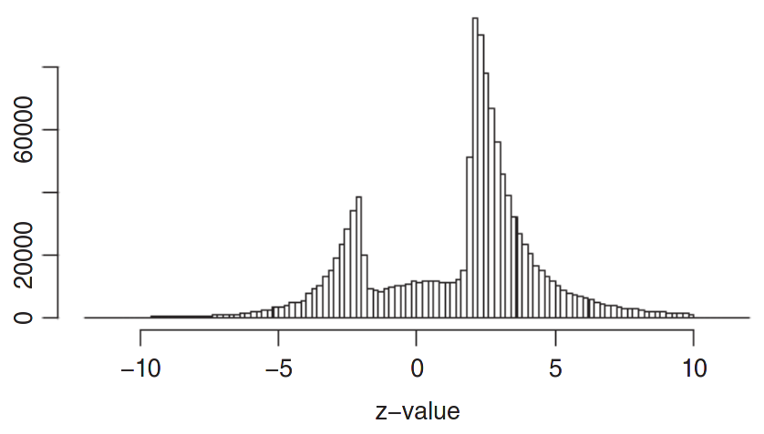

# Replication crisis {#replication-crisis}

In recent years, many team efforts have performed so-called replications of existing methodological papers to assess the robustness of their findings. Perhaps unsurprisingly, many replications failed to yield anything like what authors used to claim, or found much weaker findings. This chapter examines some of the causes of this lack of replicability.

:::keyidea

* Defining replicability and reproducibility.
* Understanding the scale of the replication crisis.
* Recognizing common statistical fallacies.
* Listing strategies for enhancing reproducibility.

:::


We adopt the terminology of @Claerbout/Karrenbach:1992: a study is said to be **reproducible** if an external person with the same data and enough indications about the procedure (for example, the code and software versions, etc.) can obtain consistent results that match those of a paper. A related scientific matter is **replicability**, which is the process by which new data are collected to test the same hypothesis, potentially using different methodology. Reproducibility is important because it enhances the credibility of one's work. Extensions that deal with different analyses leading to the same conclusion are described in [The Turing Way]([https://the-turing-way.netlify.app/reproducible-research/overview/overview-definitions.html]) and presented in \@ref(fig:turingrepdo).


```{r turingrepdo, echo = FALSE, fig.cap = "Definition of different dimensions of reproducible research (from The Turing Way project, illustration by Scriberia)."}
knitr::include_graphics("figures/turing_way.jpg")
```

Why is reproducibility and replicability important? In a thought provoking paper, @Ioannidis:2005 claimed that most research findings are wrong. The abstract of his paper stated

> There is increasing concern that most current published research findings are false. [...] In this framework, a research finding is less likely to be true when the studies conducted in a field are smaller; when effect sizes are smaller; when there is a greater number and lesser preselection of tested relationships; where there is greater flexibility in designs, definitions, outcomes, and analytical modes; when there is greater financial and other interest and prejudice; and when more teams are involved in a scientific field in chase of statistical significance. 

Since its publication, collaborative efforts have tried to assess the scale of the problem by reanalysing data and trying to replicate the findings of  published research. For example, the "Reproducibility [sic] Project: Psychology" [@Nosek:2015]

> conducted replications of 100 experimental and correlational studies published in three psychology journals using high powered designs and original materials when available. Replication effects were half the magnitude of original effects, representing a substantial decline. Ninety seven percent of original studies had significant results. Thirty six percent of replications had significant results; 47% of original effect sizes were in the 95% confidence interval of the replication effect size; 39% of effects were subjectively rated to have replicated the original result; and, if no bias in original results is assumed, combining original and replication results left 68% with significant effects. [...]

A large share of findings in the review were not replicable or the effects were much smaller than claimed, as shown by [Figure 2 from the study](https://osf.io/447b3/).
Such findings show that the peer-review procedure is not foolproof: the "publish-or-perish" mindset in academia is leading many researchers to try and achieve statistical significance at all costs to meet the 5% level criterion, whether involuntarily or not. This problem has many names: $p$-hacking, harking or to paraphrase a [story of Jorge Luis Borges](https://en.wikipedia.org/wiki/The_Garden_of_Forking_Paths), the garden of forking paths. There are many degrees of freedom in the analysis for researchers to refine their hypothesis after viewing the data, conducting many unplanned comparisons and reporting selected results.

```{r repropvaluescorr, echo = FALSE, fig.cap = "Figure 2 from @Nosek:2015, showing scatterplot of effect sizes for the original and the replication study by power, with rugs and density plots by significance at the 5% level."}
knitr::include_graphics("figures/RPP_psycho_repro.png")
```

Another problem is selective reporting. Because a large emphasis is placed on statistical significance, many studies that find small effects are never published, resulting in a gap. Figure \@ref(fig:reprozscores) from @vanZwet:2021 shows $z$-scores obtained by transforming confidence intervals reported in @Barnett:2019. The authors used data mining techniques to extract confidence intervals from abstracts of nearly one million publication in Medline published between 1976 and 2019. If most experiments yielded no effect and were due to natural variability, the $z$-scores should be normally distributed, but Figure \@ref(fig:reprozscores) shows a big gap in the bell curve between approximately $-2$ and $2$, indicative of selective reporting. The fact that results that do not lead to $p < 0.05$ are not published is called the **file-drawer** problem.

```{r reprozscores, echo = FALSE, fig.cap = "Figure from @vanZwet:2021 based on results of @Barnett:2019; histogram of $z$-scores from one million studies from Medline."}

```

The ongoing debate surrounding the reproducibility crisis has sparked dramatic changes in the academic landscape: to enhance the quality of studies published, many journal now require authors to provide their code and data, to pre-register their studies, etc. Teams lead effort (e.g., the [Experimental Economics Replication Project](https://experimentaleconreplications.com/studies.html)) try to replicate studies, with mitigated success so far. This [inside recollection](https://devonprice.medium.com/questionable-research-practices-ive-taken-part-in-754b74dcaa51) by a graduate student shows the extent of the problem.

This course will place a strong emphasis on identifying and avoiding statistical fallacies and showcasing methods than enhance reproducibility. How can reproducible research enhance your work? For one thing, this workflow facilitates the publication of negative research, forces researchers to think ahead of time (and receive feedback). Reproducible research and data availability also leads to additional citations and increased credibility as a scientist.

Among good practices are

- pre-registration of experiments and use of a logbook.
- clear reporting of key aspects of the experiment (choice of metric, number of items in a Likert scale, etc.)
- version control systems (e.g., Git) that track changes to files and records.
- archival of raw data in a proper format with accompanying documentation.


Keeping a logbook and documenting your progress helps your collaborators, reviewers and your future-self understand decisions which may seem unclear and arbitrary in the future, even if they were the result of a careful thought process at the time you made them. Given the pervasiveness of the garden of forking paths, pre-registration helps you prevents harking because it limits selective reporting and unplanned tests, but it is not a panacea. Critics often object to pre-registration claiming that it binds people. This is a misleading claim in my view: pre-registration doesn't mean that you must stick with the plan exactly, but merely requires you to explain what did not go as planned if anything.

Version control keeps records of changes to your file and can help you retrieve former versions if you make mistakes at some point.


```{r reprotweetexcelgenes, echo = FALSE, fig.cap = "Tweet showing widespread problems related to unintentional changes to raw data by software."}
knitr::include_graphics("figures/reproducibility.png")
```

Archival of data helps to avoid unintentional and irreversible manipulations of the original data, examples of which can have large scale consequences as illustrated in Figure \@ref(fig:reprotweetexcelgenes) [@Ziemann:2016], who report flaws in genetic journals due to the automatic conversion of gene names to dates in Excel. These problems are [far from unique](https://www.theguardian.com/politics/2020/oct/05/how-excel-may-have-caused-loss-of-16000-covid-tests-in-england). While sensitive data cannot be shared "as is" because of confidentiality issues, in many instances the data can and should be made available with a licence and a DOI to allow people to reuse it, cite and credit your work.


To enforce reproducibility, many journals now have policy regarding data, material and code availability. Some journals encourage such, while the trend in recent years has been to enforce. For example, Nature require the following to be reported in all published papers:

```{r naturereportstat, echo = FALSE, fig.cap = "Screenshot of the Nature Reporting summary for statistics, reproduced under the CC BY 4.0 license."}
knitr::include_graphics("figures/Nature_reporting_statistics.png")
```


Operating in an open-science environment should be seen as an opportunity to make better science, offer more opportunities to increase your impact and increase the likelihood that your work gets published regardless of whether the results turn out to be negative. It is the *right thing* to do and it increases the quality of research produced, with collateral benefits because it forces researchers to validate their methodology before, to double-check their data and their analysis and to adopt good practice.


::: yourturn

Reflect on your workflow as applied researcher when designing and undertaking experiments. Which practical aspects could you improve upon to improve the reproducibility of your study?

::: 
