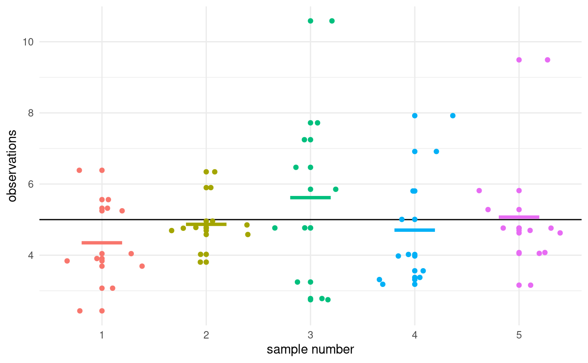
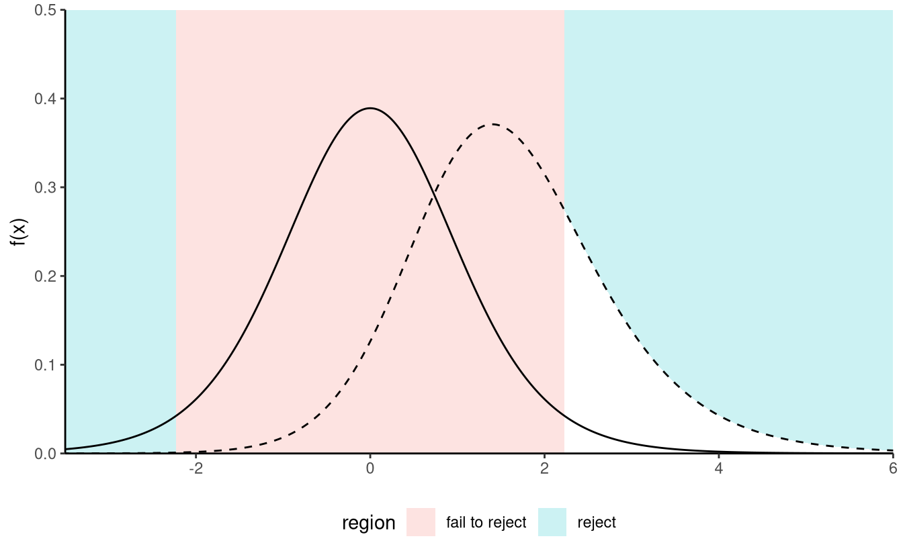

# Introduction {#introduction}

In most applied domains, empirical evidences drive the advancement of the field and data from well designed experiments contribute
to the built up of science. In order to draw conclusions in favour or against a theory, researchers turn (often unwillingly) to statistics to back up their claims. This has led to the prevalence of the use of the null hypothesis statistical testing (NHST) framework and the prevalence of $p$-values in journal articles, despite the fact that falsification of a null hypothesis is not enough to provide substantive findings for a theory.

Because introductory statistics course often present hypothesis tests without giving much thoughts to the underlying construction principles of such procedures, users often have a reductive view of statistics as a catalogue of pre-determined procedures. To make a culinary analogy, users focus on learning recipes rather than trying to understand the basics of cookery.

My objective is to teach you basic principles of experimental designs and statistical inference for data obtained from those designs using the **R** programming language. We will pay particular attention to the correct reporting and interpretation of results and learn how to review critically scientific papers using experimental designs.

## Experimental designs {experimental-intro}

The field of causal inference is concerned with inferring the effect of a treatment variable (or independent variable) on a response variable (dependent variable). In its simplest form, an experimental design is a comparison of two or more treatments (experimental conditions).

- The subjects (or experimental units) in the different groups of treatment have similar characteristics and are treated exactly the same way in the experimentation except for the treatment they are receiving. 
- The experimental treatments or conditions (also called factor, or independent variable), are manipulated and controlled by the researcher. 
- After the different treatments have been administered to subjects participating in a study, the researcher measures one or more outcomes (also called responses or dependent variables) on each subject. 
- Observed difference in the outcome variable between the experimental conditions (treatments) is called the treatment effect (or effect size). Because everything else is the same in a well controlled experiment, any treatment effect must be caused by the experimental treatments.

Richard McElreath in the [first chapter](http://xcelab.net/rmpubs/sr2/statisticalrethinking2_chapters1and2.pdf) of his book [@McElreath:2020] draws a parallel between statistical tests and golems (i.e., robots): neither

> discern when the context is inapropriate for its answers. It just knows its own procedure [...] It just does as it's told.

The responsibility therefore lies with the user to correctly use statistical procedures and be aware of their limitations: most common research questions cannot be answered by simple tools. Researchers wishing to perform innovative methodological research should contact experts and consult with statisticians **before** they collect their data to get information on how best to proceed for what they have in mind so as to avoid the risk of making misleading and false claims based on incorrect analysis or data collection.

## The reproducibility crisis {#reproducibility-crisis}

:::keyidea

* Defining replicability and reproducibility
* Understanding the scale of the reproducibility crisis
* Recognizing common statistical fallacies
* Listing strategies for enhancing reproducibility

:::

A study is said to be **reproducible** if an external person with the same data and enough indications about the procedure (for example, by providing the code and indications about software versions, etc.) can obtain consistent results that match those of a paper. A related scientific matter is **replicability**, which is the process by which new data are collected to test the same hypothesis, potentially using different methodology.

In a thought provoking paper, @Ioannidis:2005 claimed that most research findings are wrong. The abstract of his paper stated

> There is increasing concern that most current published research findings are false. [...] In this framework, a research finding is less likely to be true when the studies conducted in a field are smaller; when effect sizes are smaller; when there is a greater number and lesser preselection of tested relationships; where there is greater flexibility in designs, definitions, outcomes, and analytical modes; when there is greater financial and other interest and prejudice; and when more teams are involved in a scientific field in chase of statistical significance. 

Since its publication, collaborative efforts have tried to assess the scale of the reproducibility problem by reanalysing data and trying to replicate the findings of  published research. For example, the "Reproducibility Project: Psychology" [@Nosek:2015]

> conducted replications of 100 experimental and correlational studies published in three psychology journals using high powered designs and original materials when available. Replication effects were half the magnitude of original effects, representing a substantial decline. Ninety seven percent of original studies had significant results. Thirty six percent of replications had significant results; 47% of original effect sizes were in the 95% confidence interval of the replication effect size; 39% of effects were subjectively rated to have replicated the original result; and, if no bias in original results is assumed, combining original and replication results left 68% with significant effects. [...]

A large share of findings in the review were not replicable or the effects were much smaller than claimed, as shown by [Figure 2 from the study](https://osf.io/447b3/).
Such findings show that the peer-review procedure is not foolproof: the "publish-or-perish" mindset in academia is leading many researchers to try and achieve statistical significance at all costs to meet the statistically significant at the 5% level criterion, whether involuntarily or not. This problem has many names: $p$-hacking, harking or to paraphrase a [story of Jorge Luis Borges](https://en.wikipedia.org/wiki/The_Garden_of_Forking_Paths), the garden of forking paths. There are many degrees of freedom in the analysis for researchers to refine their hypothesis after viewing the data, conducting many unplanned comparisons and reporting selected results.

(\#fig:repropvaluescorr)Figure 2 from @Nosek:2015, showing scatterplot of effect sizes for the original and the replication study by power, with rugs and density plots by significance at the 5% level.

Another problem is selective reporting. Because a large emphasis is placed on statistical significance, many studies that find small effects are never published, resulting in a gap. Figure \@ref(fig:reprozscores) from @vanZwet:2021 shows $z$-scores obtained by transforming confidence intervals reported in @Barnett:2019, They used data mining techniques to extract confidence intervals from abstracts of nearly one million publication in Medline published between 1976 and 2019. 
If each finding was published, the $z$-scores should be normally distributed, but Figure \@ref(fig:reprozscores) shows a big gap in the bell curve between approximately $-2$ and $2$. 

(\#fig:reprozscores)Figure from @vanZwet:2021 based on results of @Barnett:2019; histogram of $z$-scores from one million studies from Medline.

The ongoing debate surrounding the reproducibility crisis has sparked dramatic changes in the academic landscape: to enhance the quality of studies published, many journal now require authors to provide their code and data, to pre-register their studies, etc. Teams lead effort (e.g., the [Experimental Economics Replication Project](https://experimentaleconreplications.com/studies.html)) try to replicate studies, with mitigate success. This [inside recollection](https://devonprice.medium.com/questionable-research-practices-ive-taken-part-in-754b74dcaa51) by a graduate student shows the extent of the problem.

This course will place a strong emphasis on identifying and avoiding statistical fallacies and showcasing methods than enhance reproducibility. How can reproducible research enhance your work? For one thing, this workflow facilitates the publication of negative research, forces researchers to think ahead of time (and receive feedback). Reproducible research and data availability also leads to additional citations and increased credibility as a scientist.

Among good practices are

- pre-registration of experiments and use of a logbook.
- version control systems (e.g., Git) that track changes to files and records.
- archival of raw data in a proper format with accompanying documentation.

Keeping a logbook and documenting your progress helps your collaborators, reviewers and your future-self understand decisions which may seem unclear and arbitrary in the future, even if they were the result of a careful thought process at the time you made them. Given the pervasiveness of the garden of forking paths, pre-registration helps you prevents harking because it limits selective reporting and unplanned tests, but it is not a panacea. Critics often object to pre-registration claiming that it binds people. This is a misleading claim in my view: pre-registration doesn't mean that you must stick with the plan exactly, but merely requires to explain what did not go as planned.

Version control keeps records of changes to your file and can help you retrieve former versions if you make mistakes at some point.

(\#fig:reprotweetexcelgenes)Tweet showing widespread problems related to unintentional changes to raw data by software.

Archival of data helps to avoid unintentional and irreversible manipulations of the original data, examples of which can have large scale consequences as illustrated in Figure \@ref(fig:reprotweetexcelgenes) [@Ziemann:2016], who report flaws in genetic journals due to the automatic conversion of gene names to dates. These problems are [far from unique](https://www.theguardian.com/politics/2020/oct/05/how-excel-may-have-caused-loss-of-16000-covid-tests-in-england) While sensible data cannot be shared "as is" because of confidentiality issues, in many instances the data can and should be made available with a licence and a DOI to allow people to reuse, cite and credit your work.

Operating in an open-science environment should be seen as an opportunity to make better science, offer more opportunities to increase your impact and increase the publication of work regardless of whether the results turn out to be negative. It is the right thing to do and it increases the quality of research produced, with collateral benefits because it forces researchers to validate their methodology before, to double-check their data and their analysis and to adopt good practice.

::: outsidethebox

Reflect on your workflow as applied researcher when designing and undertaking experiments. Which practical aspects could you improve upon to improve the reproducibility of your study?

:::

## Planning of experiments  {#planning-experiments}

We outline the various steps a research must undertake in an experimental setting.

## Population and samples {#population-sample}

Generally, we will seek to estimate characteristics of a population using only a sample (a sub-group of the population of smaller size). The **population of interest** is a collection of individuals which the study targets. For example, the Labour Force Survey (LFS) is a monthly study conducted by Statistics Canada, who define the target population as "all members of the selected household who are 15 years old and older, whether they work or not." Asking every Canadian meeting this definition would be costly and the process would be long: the characteristic of interest (employment) is also a snapshot in time and can vary when the person leaves a job, enters the job market or become unemployed.

In general, we therefore consider only **samples** to gather the information we seek to obtain. The purpose of **statistical inference** is to draw conclusions about the population, but using only a share of the latter and accounting for sources of variability. The pollster George Gallup made this great analogy between sample and population:

> One spoonful can reflect the taste of the whole pot, if the soup is well-stirred

A **sample** is a sub-group of individuals drawn at random from the population. We won't focus on data collection, but keep in mind the following information: for a sample to be good, it must be representative of the population under study.

Because the individuals are selected at **random** to be part of the sample, the measurement of the characteristic of interest will also be random and change from one sample to the next. While larger samples typically carry more information, sample size is not a guarantee of quality, as the following example demonstrates.

Because sampling is costly, we can only collect limited information about the variable of interest. Experimental design revolves in large part in understanding how best to allocate our resources to attain a specified goal.

## Sources of variability

We call summaries $T$ of the data **statistics**, as they compress the information contained in a sample into summary. For example, the sample mean $\overline{Y}=n^{-1}(Y_1 + \cdots + Y_n)$ is a function of the data and an estimator of the population mean $\mu$. Because the inputs of the function $\overline{Y}$ are random, the resulting estimator is also random and we illustrate this point below.

Figure \@ref(fig:samplevar) shows five simple random samples of size $n=10$ drawn from an hypothetical population with mean $\mu$ and standard deviation $\sigma$.

(\#fig:samplevar)Five samples of size $n=10$ drawn from a common population with mean $\mu$ (horizontal line). The colored segments show the sample means of each sample.

We can clearly see from Figure \@ref(fig:samplevar) that the sample mean varies from one sample to the next as a result of the sampling variability. The astute eye will also notice that the sample means are less dispersed around $\mu$ than the individual measurements. This is because the sample mean $\overline{Y}$ is based on multiple observations and information accumulates.

Simply looking at the values of the sample mean does not tell the whole picture: we must also consider its variability. The square root of the variance of a statistic is termed **standard error**; it should not be confused with the standard deviation $\sigma$ of the population from which $Y$ is drawn. One can show that the standard error of the sample mean is $\mathsf{se}(\overline{Y}) = \sigma/\sqrt{n}$. Both standard deviation and standard error are expressed in the same units as the measurements, so are easier to interpret than variance.

In the next section, we outline how hypothesis testing helps us disentangle the signal from the noise.

## Hypothesis testing {#tests}

An hypothesis test is a binary decision rule used to evaluate the statistical evidence provided by a sample to make a decision regarding the underlying population. The main steps involved are:

- define the model parameters
- formulate the alternative and null hypothesis
- choose and calculate the test statistic
- obtain the null distribution describing the behaviour of the test statistic under $\mathscr{H}_0$
- calculate the _p_-value
- conclude (reject or fail to reject $\mathscr{H}_0$) in the context of the problem.

A good analogy for hypothesis tests is a trial for murder on which you are appointed juror.

- The judge lets you choose between two mutually exclusive outcome, guilty or not guilty, based on the evidence presented in court.
- The presumption of innocence applies and evidences are judged under this optic: are evidence remotely plausible if the person was innocent?  The burden of the proof lies with the prosecution to avoid as much as possible judicial errors. The null hypothesis $\mathscr{H}_0$ is *not guilty*, whereas the alternative $\mathscr{H}_a$ is *guilty*. If there is a reasonable doubt, the verdict of the trial will be not guilty.
- The test statistic (and the choice of test) represents the summary of the proof. The more overwhelming the evidence, the higher the chance the accused will be declared guilty. The prosecutor chooses the proof so as to best outline this: the choice of evidence (statistic) ultimately will maximize the evidence, which parallels the power of the test.
- The null distribution is the benchmark against which to judge the evidence (jurisprudence). Given the proof, what are the odds assuming the person is innocent? 
- The final step is the verdict. This is a binary decision, guilty or not guilty. For an hypothesis test performed at level $\alpha$, one would reject (guilty) if the _p_-value is less than $\alpha$. Even if we declare the person not guilty, this doesn't mean the defendant is innocent and vice-versa.

### Hypothesis

In statistical tests we have two hypotheses: the null hypothesis ($\mathscr{H}_0$) and the alternative hypothesis ($\mathscr{H}_1$). Usually, the null hypothesis is a single numerical value (the 'status quo') and the alternative is what we're really interested in testing. A statistical hypothesis test allows us to decide whether or not our data provides enough evidence to reject $\mathscr{H}_0$ in favour of $\mathscr{H}_1$, subject to some pre-specified risk of error. Usually, hypothesis tests involve a parameter, say $\theta$, which characterizes the underlying distribution at the population level ans whose value is unknown. A two-sided hypothesis test regarding a parameter $\theta$ has the form
\begin{align*}
\mathscr{H}_0: \theta=\theta_0 \qquad \text{versus} \qquad \mathscr{H}_a:\theta \neq \theta_0.
\end{align*}
We are testing whether or not $\theta$ is precisely equal to the value $\theta_0$. 

In completely randomized experiments with a single factor, we will be testing whether the mean of $K$ different sub-populations are equal. Let $\mu_1, \ldots, \mu_K$ denote the expectation or theoretical mean of each of the $K$ sub-populations. Equality of means translates into 
\begin{align*}
\mathscr{H}_0:& \mu_1 = \cdots = \mu_K
\mathscr{H}_a:& \text{at least two means are different, }\mu_i \neq \mu_j (1 \leq i < j \leq K).
\end{align*}
Note that the null hypothesis is a single value, whereas the alternative is the complement, i.e. all potential scenarios for which not all expectations are equal.

One slight complication arising from the above is that the expectations $\mu_1, \ldots, \mu_K$ are unknown.  We can assess this by comparing the sample means in each group. These are noisy estimates of the expectation: it is this inherent variability that limits our ability to detect differences in mean.

### Test statistic

A test statistic $T$ is a function of the data that summarize the information contained in the sample for $\theta$. The form of the test statistic is chosen such that we know its underlying distribution under $\mathscr{H}_0$, that is, the potential values taken by $T$ and their relative probability if $\mathscr{H}_0$ is true. Indeed, $Y$ is a random variable and its value change from one sample to the next.
This allows us to determine what values of $T$ are likely if $\mathscr{H}_0$ is true. Many statistics we will consider are **Wald statistic**, of the form
\begin{align*}
T = \frac{\widehat{\theta} - \theta_0}{\mathrm{se}(\widehat{\theta})}
\end{align*}
where $\widehat{\theta}$ is an estimator of $\theta$, $\theta_0$ is the postulated value of the parameter and  $\mathrm{se}(\widehat{\theta})$ is an estimator of the standard deviation of the test statistic $\widehat{\theta}$.

For example, to test whether the mean of a population is zero, we set
\begin{align*}
\mathscr{H}_0: \mu=0, \qquad  \mathscr{H}_a:\mu \neq 0,
\end{align*}
and the Wald statistic is
\begin{align*}
T &= \frac{\overline{X}-0}{S_n/\sqrt{n}}
\end{align*}
where $\overline{X}$ is the sample mean of $X_1, \ldots, X_n$,
\begin{align*}
\overline{X} &= \frac{1}{n} \sum_{i=1}^n X_i = \frac{X_1+ \cdots + X_n}{n}
\end{align*}
and the standard error (of the mean) $\overline{X}$ is $S_n/\sqrt{n}$; the sample variance $S_n$ is an estimator of the standard deviation $\sigma$,
\begin{align*}
S^2_n &= \frac{1}{n-1} \sum_{i=1}^n (X_i-\overline{X})^2.
\end{align*}

Its important to distinguish between procedures/formulas and their numerical values. An **estimator** is a rule or formula used to calculate an estimate of some parameter or quantity of interest based on observed data. For example, the sample mean $\bar{X}$ is an estimator of the population mean $\mu$. Once we have observed data we can actually compute the sample mean, that is, we have an estimate --- an actual value.  In other words,

- an estimator is the procedure or formula telling us how to use sample data to compute an estimate. Its a random variable since it depends on the sample.
- an estimate is the numerical value obtained once we apply the formula to observed data

### Null distribution and _p_-value

The _p_-value allows us to decide whether the observed value of the test statistic $T$ is plausible under $\mathscr{H}_0$. Specifically, the _p_-value is the probability that the test statistic is equal or more extreme to the estimate computed from the data, assuming $\mathscr{H}_0$ is true. Suppose that based on a random sample $X_1, \ldots, X_n$ we obtain a statistic whose value $T=t$. For a two-sided test $\mathscr{H}_0:\theta=\theta_0$ vs. $\mathscr{H}_a:\theta \neq \theta_0$, the _p_-value is $\mathsf{Pr}_0(|T| \geq |t|)$. If the distribution of $T$ is symmetric around zero, the _p_-value is
\begin{align*}
p = 2 \times \mathsf{Pr}_0(T \geq |t|).
\end{align*}

Consider the example of a two-sided test involving the population mean $\mathscr{H}_0:\mu=0$ against the alternative $\mathscr{H}_1:\mu \neq 0$. Assuming the random sample comes from a normal (population) $\mathsf{No}(\mu, \sigma^2)$, it can be shown that if $\mathscr{H}_0$ is true (that is, if $\mu=0$), the test statistic
\begin{align*}
T = \frac{\overline{X}}{S/\sqrt{n}}
\end{align*}
follows a Student-*t* distribution with $n-1$ degrees of freedom, denoted $\mathsf{St}_{n-1}$. This allows us to calculate the *p*-value (either from a table, or using some statistical software). The Student-*t* distribution is symmetric about zero, so the _p_-value is $P = 2\times\mathsf{Pr}(T_{n-1} > |t|)$, where $T \sim \mathsf{St}_{n-1}$.

### Conclusion

The *p*-value allows us to make a decision about the null hypothesis. If $\mathscr{H}_0$ is true, the *p*-value follows a uniform distribution. [Thus, if the *p*-value is small](https://xkcd.com/1478/), this means observing an outcome more extreme than $T=t$ is unlikely, and so we're inclined to think that $\mathscr{H}_0$ is not true. There's always some underlying risk that we're making a mistake when we make a decision. In statistic, there are [two type of errors](https://xkcd.com/2303/):

- type I error: we reject $\mathscr{H}_0$ when $\mathscr{H}_0$ is true,
- type II error: we fail to reject $\mathscr{H}_0$ when $\mathscr{H}_0$ is  false.

These hypothesis are not judged equally: we seek to avoid error of type I (judicial errors, corresponding to condamning an innocent). To prevent this, we fix a the level of the test, $\alpha$, which captures our tolerance to the risk of commiting a type I error: the higher the level of the test $\alpha$, the more often we will reject the null hypothesis when the latter is true. The value of $\alpha \in (0, 1)$ is the probability of rejecting $\mathscr{H}_0$ when $\mathscr{H}_0$ is in fact true,
\begin{align*}
\alpha = \mathsf{Pr}_0\left(\text{ reject } \mathscr{H}_0\right).
\end{align*}
The level $\alpha$ is fixed beforehand, typically $1$\%, $5$\% or $10$\%. Keep in mind that the probability of type I error is $\alpha$ only if the null model for $\mathscr{H}_0$ is correct (sic) and correspond to the data generating mechanism.

The focus on type I error is best understood by thinking about costs of moving away from the status quo: a new website design or branding will be costly to implement, so you want to make sure there are enough evidence this is the better alternative.

| **Decision** \\ **true model** | $\mathscr{H}_0$ | $\mathscr{H}_a$ |
| :-- | :-: | :-: |
| fail to reject $\mathscr{H}_0$ | $\checkmark$ | type II error |
| reject $\mathscr{H}_0$ |type I error | $\checkmark$|

To make a decision, we compare our *p*-value $P$ with the level of the test $\alpha$:

- if $P < \alpha$, we reject $\mathscr{H}_0$;
- if $P \geq \alpha$, we fail to reject $\mathscr{H}_0$.

Do not mix up level of the test (probability fixed beforehand by the researcher) and the *p*-value. If you do a test at level 5\%, the probability of type I error is by definition $\alpha$ and does not depend on the *p*-value. The latter is conditional probability of observing a more extreme likelihood given the null distribution $\mathscr{H}_0$ is true.

### Power

There are two sides to an hypothesis test: either we want to show it is not unreasonable to assume the null hypothesis, or else we want to show beyond reasonable doubt that a difference or effect is significative: for example, one could wish to demonstrate that a new website design (alternative hypothesis) leads to a significant increase in sales relative to the status quo. Our ability to detect these improvements and make discoveries depends on the power of the test: the larger the power, the greater our ability to reject $\mathscr{H}_0$ when the latter is false.

Failing to reject $\mathscr{H}_0$ when $\mathscr{H}_a$ is true corresponds to the definition of type II error, the probability of which is $1-\gamma$, say. The **power of a test** is the probability of rejecting $\mathscr{H}_0$ when $\mathscr{H}_0$ is false, i.e.,
\begin{align*}
\gamma = \mathsf{Pr}_a(\text{reject} \mathscr{H}_0)
\end{align*}
Depending on the alternative models, it is more or less easy to detect that the null hypothesis is false and reject in favor of an alternative.

(\#fig:power1)Comparison between null distribution (full curve) and a specific alternative for a *t*-test (dashed line). The power corresponds to the area under the curve of the density of the alternative distribution which is in the rejection area (in white).

(\#fig:power2)Increase in power due to an increase in the mean difference between the null and alternative hypothesis. Power is the area in the rejection region (in white) under the alternative distribution (dashed): the latter is more shifted to the right relative to the null distribution (full line).

(\#fig:power3)Increase of power due to an increase in the sample size or a decrease of standard deviation of the population: the null distribution (full line) is more concentrated. Power is given by the area (white) under the curve of the alternative distribution (dashed). In general, the null distribution changes with the sample size.

We want a test to have high power, i.e., that $\gamma$ be as close to 1 as possible. Minimally, the power of the test should be $\alpha$ because we reject the null hypothesis $\alpha$ fraction of the time even when $\mathscr{H}_0$ is true. Power depends on many criteria, notably

- the effect size: the bigger the difference between the postulated value for $\theta_0$ under $\mathscr{H}_0$ and the observed behavior, the easier it is to detect it.
(Figure \@ref(fig:power3));
- variability: the less noisy your data, the easier it is to detect differences between the curves (big differences are easier to spot, as Figure \@ref(fig:power2) shows);
- the sample size: the more observation, the higher our ability to detect significative differences because the standard error decreases with sample size $n$ at a rate (typically) of $n^{-1/2}$. The null distribution also becomes more concentrated as the sample size increase.
- the choice of test statistic: for example, rank-based statistics discard information about the actual values and care only about relative ranking. Resulting tests are less powerful, but are typically more robust to model misspecification and outliers. The statistics we will choose are standard and amongst the most powerful: as such, we won't dwell on this factor.

To calculate the power of a test, we need to single out a specific alternative hypothesis. In very special case, analytic derivations are possible: for example, the one-sample *t*-test statistic $T=\sqrt{n}(\overline{X}_n-\mu_0)/S_n \sim \mathcal{T}_{n-1}$ for a normal sample follows a noncentral Student-$t$ distribution with noncentrality parameter $\Delta$ if the expectation of the population is $\Delta + \mu_0$. In general, such closed-form expressions are not easily obtained and we compute instead the power of a test through Monte Carlo methods. For a given alternative, we simulate repeatedly samples from the model, compute the test statistic on these new samples and the associated *p*-values based on the postulated null hypothesis. We can then calculate the proportion of tests that lead to a rejection of the null hypothesis at level $\alpha$, namely the percentage of *p*-values smaller than $\alpha$.

### Confidence interval

A **confidence interval** is an alternative way to present the conclusions of an hypothesis test performed at significance level $\alpha$. It is often combined with a point estimator $\hat{\theta}$ to give an indication of the variability of the estimation procedure. Wald-based  $(1-\alpha)$ confidence intervals for a parameter  $\theta$ are of the form
\begin{align*}
\widehat{\theta} \pm \mathfrak{q}_{\alpha/2} \; \mathrm{se}(\widehat{\theta})
\end{align*}
where $\mathfrak{q}_{\alpha/2}$ is the $1-\alpha/2$ quantile of the null distribution of the Wald statistic
\begin{align*}
T =\frac{\widehat{\theta}-\theta}{\mathrm{se}(\widehat{\theta})},
\end{align*}
and where $\theta$ represents the postulated value for the fixed, but unknown value of the parameter. The bounds of the confidence intervals are random variables, since both $\widehat{\theta}$ and $\mathrm{se}(\widehat{\theta})$ are random variables: their values depend on the sample, and will vary from one sample to another.

For example, for a random sample $X_1, \ldots, X_n$ from a normal distribution $\mathsf{No}(\mu, \sigma)$, the ($1-\alpha$) confidence interval for the population mean $\mu$ is
\begin{align*}
\overline{X} \pm t_{n-1, \alpha/2} \frac{S}{\sqrt{n}}
\end{align*}
where $t_{n-1,\alpha/2}$ is the $1-\alpha/2$ quantile of a Student-$t$ distribution with $n-1$ degrees of freedom.

Before the interval is calculated, there is a $1-\alpha$ probability that $\theta$ is contained in the **random** interval $(\widehat{\theta} - \mathfrak{q}_{\alpha/2} \; \mathrm{se}(\widehat{\theta}), \widehat{\theta} + \mathfrak{q}_{\alpha/2} \; \mathrm{se}(\widehat{\theta}))$, where $\widehat{\theta}$ denotes the estimator. Once we obtain a sample and calculate the confidence interval, there is no more notion of probability: the true value of the parameter $\theta$ is either in the confidence interval or not. We can interpret confidence interval's as follows: if we were to repeat the experiment multiple times, and calculate a $1-\alpha$ confidence interval each time, then roughly $1-\alpha$ of the calculated confidence intervals would contain the true value of $\theta$ in repeated samples (in the same way, if you flip a coin, there is roughly a 50-50 chance of getting heads or tails, but any outcome will be either). Our confidence is in the *procedure* we use to calculate confidence intervals and not in the actual values we obtain from a sample.

(\#fig:intconf)95\% confidence intervals for the mean of a standard normal population $\mathsf{No}(0,1)$, with 100 random samples. On average, 5\% of these intervals fail to include the true mean value of zero (in red).

If we are only interested in the binary decision rule reject/fail to reject $\mathscr{H}_0$, the confidence interval is equivalent to a *p*-value since it leads to the same conclusion. Whereas the $1-\alpha$ confidence interval gives the set of all values for which the test statistic doesn't provide enough evidence to reject  $\mathscr{H}_0$ at level $\alpha$, the *p*-value gives the probability under the null of obtaning a result more extreme than the postulated value and so is more precise for this particular value. If the *p*-value is smaller than $\alpha$, our null value $\theta$ will be outside of the confidence interval and vice-versa.

In this example, we consider the difference between the average amount spent by Y members and those of previous generations: the mean difference in the samples is -16.49 dollars and thus millenials spend more. However, this in itself is not enough to conclude that the different is significative, nor can we say it is meaningful. The amount spent online varies from one individual to the next (and plausibly from month to month), and so different random samples would yield different mean differences.

The first step of our analysis is defining the parameters corresponding to quantities of interest and formulating the null and alternative hypothesis as a function of these parameters. We will consider a test for the difference in mean of the two populations, say $\mu_1$ for the expected amount spent by generation Y and $\mu_2$ for older generations, with respective standard errors $\sigma_1$ and $\sigma_2$. We next write down our hypothesis: the researcher is interested in whether millenials spend more, so this is the alternative hypothesis, $\mathscr{H}_a: \mu_1 > \mu_2$. The null consists of all other values $\mathscr{H}_0: \mu_1 \leq \mu_2$, but only $\mu_1=\mu_2$ matters for the purpose of testing (why?)

The second step is the choice of test statistic. We consider the @Welch:1947 statistic for a difference in mean between two samples,
\begin{align*}
T = \frac{\overline{X}_1 - \overline{X}_2}{\left(\frac{S_1^2}{n_1}+\frac{S_2^2}{n_2} \right)^{1/2}}, \end{align*}
where $\overline{X}_i$ is the sample mean, $S_i^2$ is the unbiased variance estimator and $n_i$ is the sample size for group $i$ ($i=1, 2$). If the mean difference between the two samples is zero, then $\overline{X}_1-\overline{X}_2$ has mean zero and the difference has variance $\sigma^2_1/n_1+\sigma^2_2/n_2$. For our sample, the value of statistic is $T=-2.76$ Since the value changes from one sample to the next, we need to determine if this value is compatible with the null hypothesis by comparing it to the null distribution of $T$ (when $\mathscr{H}_0$ is true and $\mu_1-\mu_2=0$). We perform the test at level $\alpha=0.05$.

The third step consists in obtaining a benchmark to determine if our result is extreme or unusual. To make comparisons easier, we standardize the statistic so its has mean zero and variance one under the null hypothesis $\mu_1=\mu_2$, so as to obtain a dimensionless measure whose behaviour we know for large sample. The (mathematical) derivation of the null distribution is beyond the scope of this course, and will be given in all cases. Asymptotically, $T$ follows a standard normal distribution $\mathsf{No}(0, 1)$, but there exists a better finite-sample approximation when $n_1$ or $n_2$ is small; we use @Satterthwaite:1946 and a Student-$t$ distribution as null distribution.

It only remains to compute the *p*-value. If the null distribution is well-specified and $\mathscr{H}_0$ is true, then the random variable $P$ is uniform on $[0, 1]$; we thus expect to obtain under the null something larger than 0.95 only 5\% of the time for our one-sided alternative since we consider under $\mathscr{H}_0$ the event $\mathsf{Pr}(T > t)$. The $p$-value is $1$ and, at level 5\%, we reject the null hypothesis to conclude that millenials spend significantly than previous generation for monthly online purchases, with an estimated average difference of -16.49.
