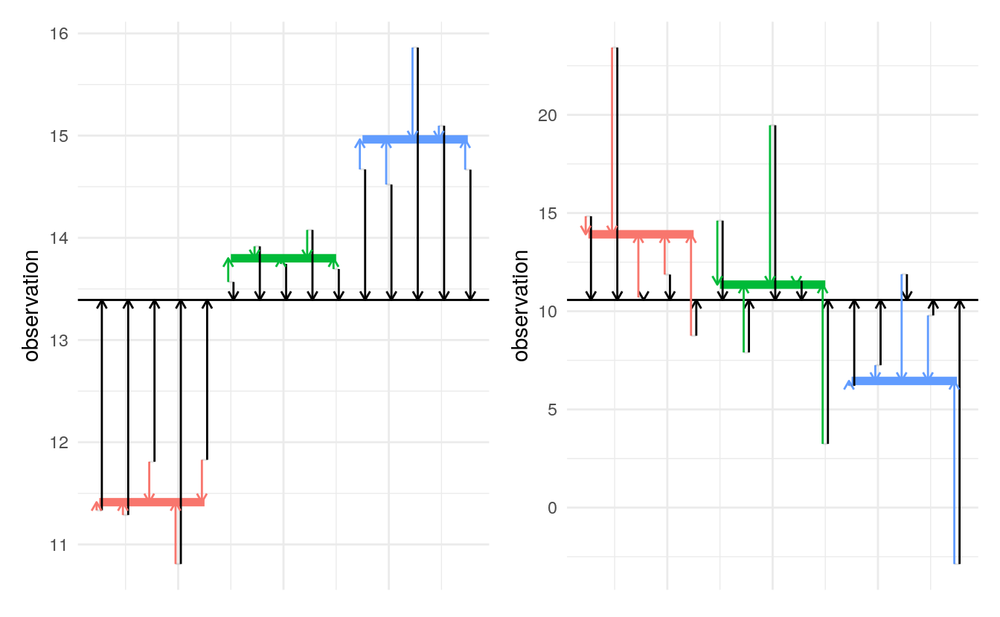
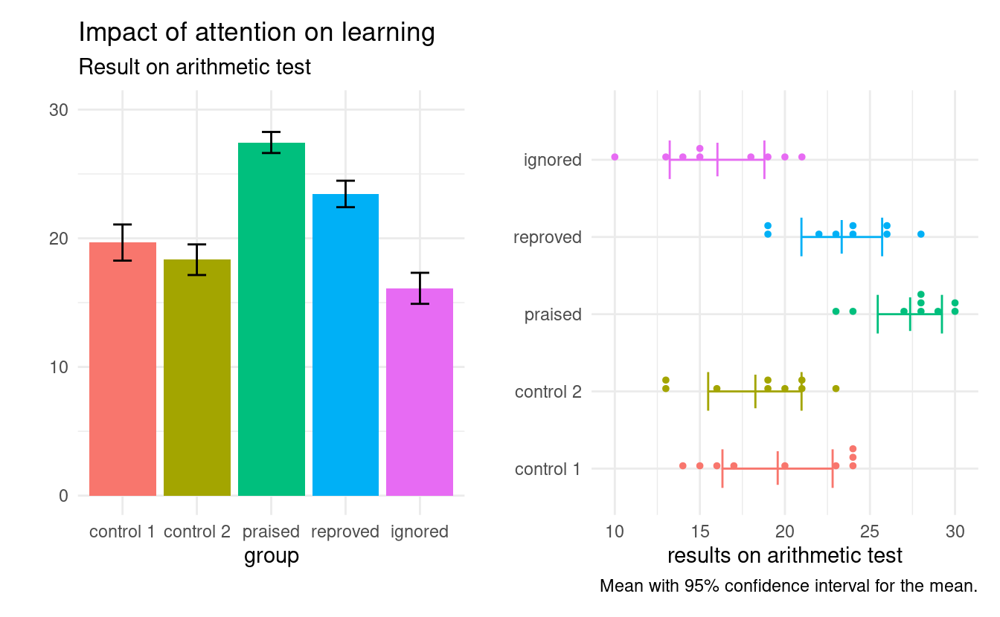

# One way analysis of variance {#onewayanova}

This chapter focuses on the one way analysis of variance. The objective is to present some of the basic concepts surrounding hypothesis test, model validation, multiple testing, the interplay between power, effect size and sample size, etc. with the easiest possible model to build intuition for these concepts. They readily generalized to more complicated linear models.

The one-way analysis of variance describes the most simple experimental setup one can consider: completely randomized experiments with one factor, in which we are solely interested in the effect of a single treatment variable with multiple levels. 

The focus is on comparisons of the average of a single outcome variable with $K$ different treatments levels, each defining a sub-population differing only in the treatment they received. 

## Hypothesis tests for the one-way analysis of variance 

A **one-way analysis of variance** compares the sample averages of each treatment group $T_1, \ldots, T_K$ to try and determine if the population averages could be the same. Since we have $K$ groups, there will be $K$ averages (one per group) to estimate. 

Let $\mu_1, \ldots, \mu_K$ denote the expectation (theoretical mean) of each of the $K$ sub-populations defined by the different treatments. Lack of difference between treatments is equivalent to equality of means, which translates into the hypotheses
\begin{align*}
\mathscr{H}_0: & \mu_1 = \cdots = \mu_K \\
\mathscr{H}_a: & \text{at least two treatments have different averages, }
\end{align*}
The null hypothesis is, as usual, a single numerical value, $\mu$. The alternative consists of all potential scenarios for which not all expectations are equal. Going from $K$ averages to one requires imposing $K-1$ restrictions (the number of equality signs), as the value of the global mean $\mu$ is left unspecified. 

### Parametrizations

The most natural parametrization is in terms of group averages: the (theoretical unknown) average for treatment $T_j$ is $\mu_j$, so we obtain $K$ parameters $\mu_1, \ldots, \mu_K$ whose estimates are the sample averages $\widehat{\mu}_1, \ldots, \widehat{\mu}_K$. One slight complication arising from the above is that the values of the population average are unknown, so this formulation is ill-suited for hypothesis testing because none of the $\mu_i$ values are known in practice and we need to make comparisons in terms of a known numerical value. 

The most common parametrization is in terms of **constrasts** (or mean differences) relative to a reference group (say $T_1$). The theoretical average of each group is written as $\mu_1 + a_i$ for treatment $T_i$, where $a_1=0$ for $T_1$ and $a_i = \mu_i-\mu_1$ otherwise. The parameters are $\mu_1, a_2, \ldots, a_K$.

An equivalent formulation writes for each treatment group the average of subpopulation $j$ as $\mu_j = \mu + \delta_j$, where $\delta_j$ is the difference between the treatment average $\mu_j$ and the global average of all groups. Imposing the constraint $\delta_1 + \cdots + \delta_K=0$ ensures that the average of effects equals $\mu$. Thus, if we know any $K-1$ of $\{\delta_1, \ldots, \delta_K\}$, we automatically can deduce the last one is automatically known. 

:::{ .example name="Impact of encouragement on teaching"}

In **R**, the `lm` function fits a linear model based on a formula of the form `response ~ explanatory`. If the explanatory is categorical (i.e., a factor), the parameters of this model are the intercept, which is the sample average of the baseline group and the other parameters are simply contrasts, i.e., the $a_i$'s.

In the sum-to-zero parametrization, obtained with `contrasts = list(... = contr.sum)`, where the ellipsis is replaced by the name of the categorical variable. In this parametrization, the intercept is the average of each treatment average, $(\widehat{\mu}_1 + \cdots + \widehat{\mu}_5)/5$; this need not coincide with the (overall) mean of the response $\widehat{\mu} = \overline{y}$ unless the sample is balanced, meaning that the number of observations in each group is the same. The other coefficients of the sum-to-zero parametrization are the differences between this intercept and the group means. Since the group means is zero, we can deduce that of the last group from the sum of the others.


We show the function call to fit a one-way ANOVA in the different parametrizations along with the sample average of each arithmetic group (the two controls who were taught separately and the groups that were praised, reproved and ignored in the third class). Note that the omitted category changes depending on the parametrization.


```r
mod_contrast <- lm(score ~ group, 
                   data = arithmetic)
mod_sum2zero <- lm(score ~ group, 
                   data = arithmetic,
                   contrasts = list(group = contr.sum))
```

<table>
<caption>(\#tab:tableanovaparam)Coefficients of the analysis of variance model for the arithmetic scores using different parametrizations.</caption>
 <thead>
  <tr>
   <th style="text-align:left;"> group </th>
   <th style="text-align:right;"> mean </th>
   <th style="text-align:right;"> contrasts </th>
   <th style="text-align:right;"> sum-to-zero </th>
  </tr>
 </thead>
<tbody>
  <tr>
   <td style="text-align:left;"> intercept </td>
   <td style="text-align:right;">  </td>
   <td style="text-align:right;"> 19.67 </td>
   <td style="text-align:right;"> 21.00 </td>
  </tr>
  <tr>
   <td style="text-align:left;"> control 1 </td>
   <td style="text-align:right;"> 19.7 </td>
   <td style="text-align:right;">  </td>
   <td style="text-align:right;"> -1.33 </td>
  </tr>
  <tr>
   <td style="text-align:left;"> control 2 </td>
   <td style="text-align:right;"> 18.3 </td>
   <td style="text-align:right;"> -1.33 </td>
   <td style="text-align:right;"> -2.67 </td>
  </tr>
  <tr>
   <td style="text-align:left;"> praised </td>
   <td style="text-align:right;"> 27.4 </td>
   <td style="text-align:right;"> 7.78 </td>
   <td style="text-align:right;"> 6.44 </td>
  </tr>
  <tr>
   <td style="text-align:left;"> reproved </td>
   <td style="text-align:right;"> 23.4 </td>
   <td style="text-align:right;"> 3.78 </td>
   <td style="text-align:right;"> 2.44 </td>
  </tr>
  <tr>
   <td style="text-align:left;"> ignored </td>
   <td style="text-align:right;"> 16.1 </td>
   <td style="text-align:right;"> -3.56 </td>
   <td style="text-align:right;">  </td>
  </tr>
</tbody>
</table>

:::


We can still assess the hypothesis by comparing the sample means in each group, which are noisy estimates of the expectation: their inherent variability will limit our ability to detect differences in mean if the signal-to-noise ratio is small.


## Sum of square decomposition

The following section tries to shed some light into how the $F$-test statistic works as a summary of evidence: it isn't straightforward in the way it appears. 


### Mathematical decomposition of sum of squares

Proceed if you want to see the mathematical intuition behind
The usual notation for this decomposition is the following: suppose $y_{ik}$ represents the $i$th person in the $k$th treatment group ($k=1, \ldots, K$) and the sample size $n$ can be split between groups as $n_1, \ldots, n_K$; in the case of a balanced sample, $n_1=\cdots=n_K = n/K$. We denote by $\widehat{\mu}_k$ the sample average in group $k$ and $\widehat{\mu}$ the overall average $(y_{11} + \cdots + y_{n_KK})/n = \sum_k  \sum_i y_{ik}$, where $\sum_i$ denotes the sum over all individuals in the group. 
Under the null model, all groups have the same mean, so the natural estimator is the sample average $\widehat{\mu}$ and likewise the group averages $\widehat{\mu}_1, \ldots, \widehat{\mu}_K$ are the correct estimators if each group has a (potentially) different mean. The more complex, which has more parameters, will always fit better because it has more possibility to accommodate differences observed in a group, even if these are spurious.
The sum of squares measures the (squared) distance between the observation and the fitted values, with the terminology total, within and between sum of squares linked to the decomposition
\begin{align*}
\underset{\text{total sum of squares} }{\sum_{i}\sum_{k} (y_{ik} - \widehat{\mu})^2} &= \underset{\text{within sum of squares} }{\sum_i \sum_k (y_{ik} - \widehat{\mu}_k)^2} +  \underset{\text{between sum of squares} }{\sum_k n_i (\widehat{\mu}_k - \widehat{\mu})^2}.
\end{align*}
The term on the left is a measure of the variability for the null model ($\mu_1 = \cdots = \mu_K$) under which all observations are predicted by the overall average $\widehat{\mu}$. The within sum of squares measures likewise the distance between the two. We can measure how much worst we do with the alternative model (different average per group) relative to the null by calculating the between sum of square. This quantity in itself varies with the sample size (the more observations, the larger it is) so we must standardize as usual this quantity so that we have a suitable benchmark. In large samples, the $F$ statistic 

The $F$-statistic is 
\begin{align}
F &= \frac{\text{between-group variability}}{\text{within-group variability}} \\&= \frac{\text{between sum of squares}/(K-1)}{\text{within sum of squares}/(n-K)}
(\#eq:Fstatheuristic)
\end{align}
If there is no difference in mean, the _F_-statistic follows in large sample a _F_-distribution, whose shape is governed by two parameters named degrees of freedom which appear in eq.\@ref(eq:Fstatheuristic) as scaling factors to ensure proper standardization. The first is the number of restrictions imposed by the null hypothesis ($K-1$, the number of groups minus one for the one-way analysis of variance), and the second is the number of observations minus the number of *parameters estimates* for the mean ($n-K$, where $n$ is the overall sample size and $K$ is the number of groups).^[There are only $K$ parameter estimates for the mean, since the overall mean is full determined by the other averages with $n\widehat{\mu} =n_1\widehat{\mu}_1 + \cdots + n_K \widehat{\mu}_K$.]

Figure \@ref(fig:squareddistanova) shows how the difference between these distances can encompass information that the null is wrong. The sum of squares is obtained by computing the squared length of these vectors and adding them up. The left panel shows strong signal-to-noise ratio, so that, on average, the black segments are much longer than the colored ones. This indicates that the model obtained by letting each group have its own mean is much better than the other. The picture in the right panel is not as clear: on average, the colored arrows are shorter, but the difference in length is much smaller relative to the colored arrows.

<div class="figure" style="text-align: center">

<p class="caption">(\#fig:squareddistanova)Observations drawn from three groups from a model with a strong (left) and weak (right) signal-to-noise ratio, along with their sample mean (colored horizontal segments) and the overall average (horizontal line). Arrows indicate the magnitude of the difference between the observation and the (group/average) mean.</p>
</div>
  
If there is no mean difference (null), the numerator is an estimator of the population variance, and so is the denominator of \@ref(eq:Fstatheuristic). If there are many observations (and relatively fewer groups), the ratio is approximately one on average. 


## Graphical representation

How to represent data in a publication? The purpose of the visualization is to provide intuition that extends beyond the reported descriptive statistics and to check the model assumptions. Most of the time, we will be interested in averages and dispersion, but plotting the raw data can be insightful.

<div class="figure" style="text-align: center">

<p class="caption">(\#fig:dynamiteplot)Two graphical representations of the arithmetic data: dynamite plot (left) showing the sample average with one standard error above and below, and dot plot with the sample mean (right).</p>
</div>

In a one-way analysis of variance, the outcome is a continuous numerical variable, whereas the treatment or explanatory is a categorical variable. Basic graphics for this combination include most graphics available for one dimensional data including estimates of the distribution (dot plots, histograms, density plots) or rugs for the raw data, but replicated for each level of the factor. 

Scatterplots are not a good option because observations get overlaid. There are multiple workarounds, involving transparency, bubble plots for discrete data with ties, adding noise (jitter) to every observation or drawing values using a thin line if the data are continuous. 

Journals are plagued with poor visualisations, a prime example of which is the infamous [dynamite plot](https://simplystatistics.org/2019/02/21/dynamite-plots-must-die/). The problem with this (or with other summary statistics) is that they hide precious information about the spread and values taken by the data. The height of the bar is the sample average and the bars extend beyond one standard error: this makes little sense as we end up comparing areas, whereas the mean is a single number.
The right panel of Figure \@ref(fig:dynamiteplot) shows instead a dot plot for the data, i.e., sample values with ties stacked for clarity, along with the sample average and a 95% confidence interval for the latter as a line underneath. In this example, there are not enough observations per group to produce histograms and the like and a boxplot would also be useless: a summary of nine numbers isn't really needed.

If we have a lot of data, it sometimes help to represent selected summary statistics. A box-and-whiskers plot (or boxplot) is a commonly used graphic representing the whole data distribution using five numbers

- The box gives the quartiles, say $q_1$, $q_2$ (median) and $q_3$ of the distribution: 50\% of the observations are smaller or larger than $q_2$, 25\% are smaller than $q_1$ and 75\% are smaller than $q_3$ for the sample.
- The whiskers extend up to $1.5$ times the box width ($q_3-q_1$) (so the largest observation that is smaller than $q_3+1.5(q_3-q_1)$, etc.)

Observations beyond the whiskers are represented by dots or circles, sometimes termed outliers. However, beware of this terminology: the larger the sample size, the more values will fall outside the whiskers (about 0.7\% for normal data). This is a drawback of boxplots, which were conceived at a time where big data didn't exist. If you want to combine boxplots with the raw data, remove the display of outliers to avoid artefacts.

<div class="figure" style="text-align: center">

<p class="caption">(\#fig:boxplot)Box-and-whiskers plot</p>
</div>


## Model assumptions

The basic assumption of most designs is that we can decompose the outcome into two components [@Cox:1958]
\begin{align}
\begin{pmatrix} \text{quantity depending only } \\ 
\text{on the particular unit} 
\end{pmatrix} + 
\begin{pmatrix} \text{quantity depending} \\
 \text{on the treatment used}\end{pmatrix}
 (\#eq:additive)
\end{align}
This **additive** decomposition further assumes that each unit is unaffected by (i.e., independent of) the treatment of the other units and that the average effect of the treatment is constant. This notably means that usually the difference between treatments can be estimated by the difference in sample means

More generally, the test statistic may rely on additional assumptions. The $F$-test of the global null $\mu_1 = \cdots \mu_K$ assumes that the $i$th observation of group $k$, say $y_{ik}$, has average $\mathsf{E}(Y_{ik}) = \mu_k$ and variance $\mathsf{Va}(Y_{ik}) = \sigma^2$.


If the variance are unequal, this can leads to a decrease in power or inaccurate statements: statistics that do not make this assumption may be more powerful alternatives.


:::{ .example name="Additivity and transformations"}

Chapter 2 of @Cox:1958 discusses the assumption of additivity and provides useful examples showing when it cannot be taken for granted. One of them, Example 2.3, is a scenario in which the experimental units are participants and they are asked to provide a ranking of different kindergarden students on their capacity to interact with others in games, ranked on a scale of 0 to 100. A random group of students receives additional orthopedagogical support, while the balance is in the business-as-usual setting (control group). Since there are intrinsic differences at the student level, one could consider a **paired experiment** and take as outcome the difference in sociability scores at the beginning and at the end of the school year. 

One can expect the treatment to have more impact on people with low sociability skills who were struggling to make contacts: a student who scored 50 initially might see an improvement of 20 points with support relative to 10 in the business-as-usual scenario, whereas another who is well integrated and scored high initially may see an improvement of only 5 more had (s)he been assigned to the support group. This implies that the treatment effects are not constant over the scale, a violation of the additivity assumption. One way to deal with this is via transformations: @Cox:1958 discusses the transformation $\log\{(x+0.5)/(50-x)\}$ to reduce the warping due to scale. 

:::

Another example is in experiments where the effect of treatment is multiplicative, so that the output is of the form
\begin{align*}
\begin{pmatrix} \text{quantity depending only } \\ 
\text{on the particular unit} 
\end{pmatrix} \times
\begin{pmatrix} \text{quantity depending} \\
 \text{on the treatment used}\end{pmatrix}
\end{align*}
Usually, this arises for positive responses and treatments, in which case taking natural logarithms on both sides, with $\log(xy) = \log x + \log y$ yields again an additive. 

:::{ .example name="Inadequacy of additivity based on context"}

This example is adapted from @Cox:1958, Example 2.2. Children suffering from attention deficit hyperactivity disorder (ADHD) may receive medication to increase their attention span, measured on a scale of 0 to 100, with 0 indicating normal attention span. An experiment can be designed to assess the impact of a standardized dose in a laboratory by comparing performances of students on a series of task before and after, when to a placebo. To make a case, suppose that students with ADHD fall into two categories: low symptoms and strong symptoms. In the low symptom group, the average attention is 8 per cent with the drug and 12 per cent with the placebo, whereas for people with strong symptoms, the average is 40 per cent among treated and 60 per cent with the placebo. If these two categories are equally represented in the experiment and the population, we would estimate an average reduction of 12 percent in the score (thus higher attention span among treated). Yet, this quantity is artificial, and a better measure would be that symptoms are for the treatment are 2/3 of those of the control (the ratio of proportions).

:::

Equation \@ref(eq:additive) also implies that the effect of the treatment is constant for all individuals. This often isn't the case: in an experimental study on the impact of teaching delivery type (online, hybrid, in person), it may be that the response to the choice of delivery mode depends on the different preferences of learning types (auditory, visual, kinestetic, etc.) Thus, recording additional measurements that are susceptible to interact may be useful; likewise, treatment allotment must factor in this variability should we wish to make it detectable.


