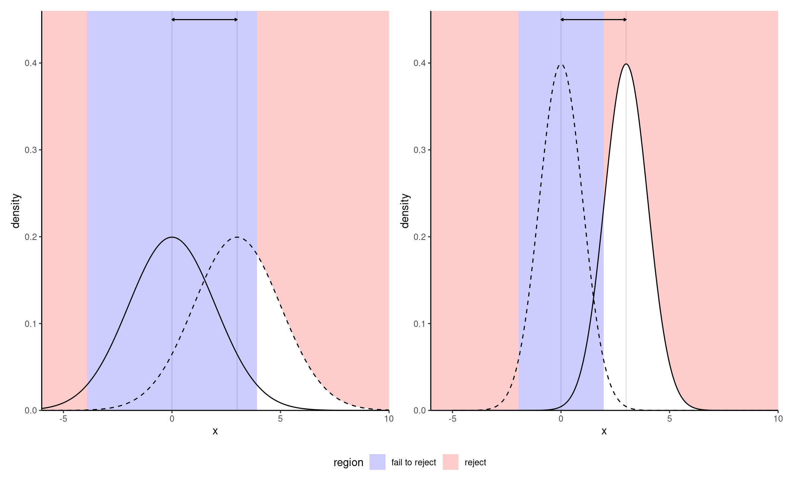

# Effect sizes and power

In social studies, it is common to write a paper containing multiple studies on a similar topic. These may use different designs, with varying sample size. If the studies uses different questionnaires, or change the Likert scale, the results and the mean difference between groups are not directly comparable between experiments.

Another related task is replication of study, whereby researchers use the same material and setting and re-run an experiment with different data. For the replication to be somewhat successful (or at least reliable), one needs to determine beforehand how many participants should be recruited in the study. In order to do so, one needs to have a measure of effect size and set the desired power.

We could think for an example of comparing statistics or $p$-values, which are by construction standardized unitless measures, making them comparable across study.
Test statistics show how outlying observed differences between experimental conditions relative to a null hypothesis, typically that of no effect (equal mean in each subgroup). However, statistics are usually a function of both the sample size (the number of observations in each experimental condition) and the effect size (how large the standardized differences between groups are), making them unsuitable for describing differences.


<div class="figure" style="text-align: center">

<p class="caption">(\#fig:fig-effectsize)True sampling distribution for a two-sample $t$-test under the alternative (rightmost curve) and null distribution (leftmost curve) with small  (left panel) and large (right panel) sample sizes.</p>
</div>


 Figure \@ref(fig:fig-effectsize) shows an example with the sampling distributions of the difference in mean under the null (curve centered at zero) and the true alternative (mean difference of two).  The area in white under the curve represents the power, which is larger with larger sample size and coincides with smaller average $p$-values for the testing procedure. 
 
 One could argue that, on the surface, every null hypothesis is wrong and that, with a sufficiently large number of observation, all observed differences eventually become "statistically significant". This has to do with the fact that we become more and more certain of the estimated means of each experimental sub-condition. Statistical significance of a testing procedure does not translate into practical relevance, which itself depends on the scientific question at hand.
For example, consider the development of a new drug for commercialization by Health Canada: what is the minimum difference between two treatments that would be large enough to justify commercialization of the new drug? If the effect is small but it leads to many lives saved, would it still be relevant? Such decision involve a trade-off between efficacy of new treatment relative to the status quo, the cost of the drug, the magnitude of the improvement, etc.


Effect size are summaries to inform about the standardized magnitude of these differences; they are used to combine results of multiple experiments using meta-analysis, or to calculate sample size requirements to replicate an effect in power studies.


## Effect sizes

There are two main classes of effect size: standardized mean differences and ratio (percentages) of explained variance. The latter are used in analysis of variance when there are multiple groups to compare.

Unfortunately, the literature on effect size is quite large. Researchers often fail to distinguish between estimand (unknown target) and the estimator that is being used, with frequent notational confusion arising due to conflicting standards and definitions. Terms are also overloaded: the same notation may be used to denote an effect size, but it will be calculated differently depending on whether the design is between-subject or within-subject (with repeated correlated measures per participant), or whether there are blocking factors.

### Standardized mean differences

To gather intuition, we begin with the task of comparing the means of two groups using a two-sample $t$-test, with the null hypothesis of equality in means or $\mathscr{H}_0: \mu_1 = \mu_2$. The test statistic is 
\begin{align*}
T =  \frac{\widehat{\mu}_2 - \widehat{\mu}_1}{\widehat{\sigma}} \left(\frac{1}{n_1}+\frac{1}{n_2}\right)^{-1/2}
\end{align*}
where $\widehat{\sigma}$ is the pooled sample size estimator. The first term, $\widehat{d}_s = (\widehat{\mu}_2 - \widehat{\mu}_1)/\widehat{\sigma}$, is termed Cohen's $d$ [@Cohen:1988] and it measures the standardized difference between groups, a form of signal-to-noise ratio. As the sample size gets larger and larger, the sample mean and pooled sample variance become closer and closer to the true population values $\mu_1$, $\mu_2$ and $\sigma$; at the same time, the statistic $T$ becomes bigger as $n$ becomes larger because of the second term.^[If we consider a balanced sample, $n_1 = n_2 = n/2$ we can rewrite the statistic as $T = \sqrt{n} \widehat{d}_s/2$ and the statement that $T$ increases with $n$ on average becomes more obvious.] 

The difference $d=(\mu_1-\mu_2)/\sigma$ has an obvious interpretation: a distance of $a$ indicates that the means of the two groups are $a$ standard deviation apart. Cohen's $d$ is sometimes loosely categorized in terms of weak ($d = 0.2$), medium ($d=0.5$) and large ($d=0.8$) effect size; these, much like arbitrary $p$-value cutoffs, are rules of thumbs. Alongside $d$, there are many commonly reported metrics that are simple transformations of $d$ describing the observed difference. This interactive  [applet](https://rpsychologist.com/cohend/) by Kristoffer Magnusson [@magnussonCohend] shows the visual impact of changing the value of $d$ along.
There are different estimators of $d$ depending on whether or not the pooled variance estimator is used. Cohen's $d$, is upward biased, meaning it gives values that are on average larger than the truth. Hedge's $g$ [@Hedges:1981] offers a bias-correction and should always be preferred as an estimator.

For these different estimators, it is possible to obtain (asymmetric) confidence intervals or tolerance intervals.[By using the pivot method [@Steiger:2004] and relating the effect size to the noncentrality parameter of the null distribution, whether $\mathsf{St}$, $\mathsf{F}$ or $\chi^2$.]


::: {.example #LiuRimMinMin2022E1effect name="The Surprise of Reaching Out"}


We consider a two-sample $t$-test for the study of @Liu.Rim.Min.Min:2022 discussed in Example \@ref(exm:LiuRimMinMin2022E1). The difference in average response index is 0.371, indicating that the responder have a higher score. The $p$-value is 0.041, showing a small effect. 

If we consider the standardized difference $d$, the group means are -0.289 standard deviations apart based on Hedge's $g$, with an associated 95% confidence interval of [-0.567, -0.011]: thus, the difference found is small (using @Cohen:1988's convention) and there is a large uncertainty surrounding it. 

There is a 42% probability that an observation drawn at random from the responder condition will exceed the mean of the initiator group (probability of superiority) and 41.9% of the responder observations will exceed the mean of the initiator.


```r
data(LRMM22_S1, package = "hecedsm")
ttest <- t.test(
  appreciation ~ role, 
  data = LRMM22_S1,
  var.equal = TRUE)
effect <- effectsize::hedges_g(
  appreciation ~ role, 
  data = LRMM22_S1, 
  pooled_sd = TRUE)
effectsize::d_to_cles(effect)
```

:::


## Power

The power is the probability of correctly rejecting a null hypothesis when it isn't true. However, whereas the null alternative corresponds to a single value (equality in mean), there are infinitely many alternatives... 

There is an intricate relation between effect size, power and sample size. Journals and grant agencies oftentimes require an estimate of the latter before funding a study, so one needs to ensure that the sample size is large enough to pick-up effects of scientific interest (good signal-to-noise), but also not overly large as to minimize time and money and make an efficient allocation of resources. This is Goldilock's principle, but having more never hurts.

If we run a pilot study to estimate the background level of noise and the estimated effect, or if we wish to perform a replication study, we will come up with a similar question in both cases: how many participants are needed to reliably detect such a difference? Setting a minimum value for the power (at least 80%, but typically 90% or 95% when feasible) ensures that the study is more reliable and ensures a high chance of success of finding an effect of at least the size specified. A power of 80% ensures that, on average, 4 in 5 experiments in which we study a phenomenon with the specified non-null effect size should lead to rejecting the null hypothesis.

In order to better understand the interplay between power, effect size and sample size, we consider a theoretical example. The purpose of displaying the formula is to (hopefully) more transparently confirm some of our intuitions about what leads to higher power. There are many things that can influence the power:

- the experimental design: a blocking design or repeated measures tend to filter out some of the unwanted variability in the population, thus increasing power relative to a completely randomized design
- the background variability $\sigma$:the noise level is oftentimes intrinsic to the measurement. It depends on the phenomenon under study, but instrumentation and the choice of scale, etc. can have an impact. Running experiments in a controlled environment helps reduce this, but researchers typically have limited control on the variability inherent to each observation.
- the sample size: as more data are gathered, information accumulates. The precision of measurements (e.g., differences in mean) is normally determined by the group with the smallest sample size, so (approximate) balancing increases power if the variance in each group is the same.
- the size of the effect: the bigger the effect, the easier it is to accurately detect (it's easier to spot an elephant than a mouse hiding in a classroom).
- the level of the test, $\alpha$: if we increase the rejection region, we technically increase power when we run an experiment under an alternative regime. However, the level is oftentimes prespecified to avoid type I errors.
We may consider multiplicity correction within the power function, such as Bonferonni's method, which is equivalent to reducing $\alpha$.

### Power for one-way ANOVA

To fix ideas, we consider the one-way analysis of variance model. In the usual setup, we consider $K$ experimental conditions with $n_k$ observations in group $k$, whose population average we denote by $\mu_k$. We can parametrize the model in terms of the overall sample average,
\begin{align*}
\mu = \frac{1}{n}\sum_{j=1}^K\sum_{i=1}^{n_j} \mu_j = \frac{1}{n}\sum_{j=1}^K n_j \mu_j,
\end{align*}
where $n=n_1 + \cdots +n_K$ is the total sample size.
The $F$-statistic of the one-way ANOVA is
\begin{align*}
F =  \frac{\text{between sum of squares}/(K-1)}{\text{within sum of squares}/(n-K)}
\end{align*}
The null distribution is $F(K-1, n-K)$.  Our interest is in understanding how the _F_-statistic behaves under an alternative.

During the construction, we stressed out that the denominator is an estimator of $\sigma^2$ under both the null and alternative. What happens to the numerator? We can write the population average for 
$$
\mathsf{E}(\text{between sum of squares}) = \sigma^2\{(K-1) + \Delta\}.
$$
where
$$
\Delta = \dfrac{\sum_{j=1}^K n_j(\mu_j - \mu)^2}{\sigma^2} = nf^2.
$$
with $f^2$ the square of Cohen's $f$. Under the null hypothesis, $\mu_j=\mu$ for $j=1, \ldots, K$ and $\Delta=0$, but if some groups have different average the displacement will be non-zero. The greater $\Delta$, the further the mode (peak of the distribution) is from unity and the greater the power.

Closer examination reveals that $\Delta$ increases with $n_j$ (sample size) and with the true squared mean difference $(\mu_j-\mu)^2$ increases effect size represented by the difference in mean, but decreases as the observation variance increases. 

Under the alternative, the distribution of the $F$ statistic is a noncentral Fisher distribution, denoted $\mathsf{F}(\nu_1, \nu_2, \Delta)$ with degrees of freedom $\nu_1$ and $\nu_2$ and noncentrality parameter $\Delta$.^[Note that the $F(\nu_1, \nu_2)$ distribution is indistinguishable from $\chi^2(\nu_1)$ for $\nu_2$ large. A similar result holds for tests with $\chi^2$ null distributions.] To calculate the power of a test, we need to single out a specific alternative hypothesis. 


The plot in \@ref(fig:power_curve) shows the null (full line) distribution and the true alternative (dashed line). The noncentral $\mathsf{F}$ is shifted to the right and right skewed. The power is the area in white in the rejection region.


Given a value of $\Delta=nf^2$ and information about the effect of interest (degrees of freedom of the effect and the residuals), we can compute the tail probability as follows

1. Compute the cutoff point: the value under $\mathscr{H}_0$ that leads to rejection at level $\alpha$
2. Compute probability below the alternative curve, from the cutoff onwards.


```r
cutoff <- qf(p = 1-alpha, df1 = df1, df2 = df2)
pf(q = cutoff,  df1 = df1, df2 = df2, 
    ncp = Delta, lower.tail = FALSE)
```

In practice, a software will return these quantities and inform us about the power. Note that these results are trustworthy provided the model assumptions are met, otherwise they may be misleading.

The most difficult question when trying to estimate sample size for a study is determining which value to use for the effect size. One could opt for a value reported elsewhere for a similar scale to estimate the variability and provide educated guesses for the mean differences. Another option is to run a pilot study and use the resulting estimates to inform about sensible values, perhaps using confidence intervals to see the range of plausible effect sizes.

Reliance on estimated effect sizes reported in the literature is debatable: many such effects are inflated as a result of the file-drawer problem and, as such, can lead to unreasonably high expectations about power. 

The `WebPower` package in **R** offers a comprehensive solution for conducting power studies, as is the free software [G*Power](https://www.psychologie.hhu.de/arbeitsgruppen/allgemeine-psychologie-und-arbeitspsychologie/gpower).

### Power in complex designs

In cases where an analytic derivations isn't possible, we can resort to simulations to approximate the power. For a given alternative, we 

- simulate repeatedly samples from the model from the hypothetical alternative world
- we compute the test statistic for each of these new samples
- we transform these to the associated *p*-values based on the postulated null hypothesis.

At the end, we calculate the proportion of tests that lead to a rejection of the null hypothesis at level $\alpha$, namely the percentage of *p*-values smaller than $\alpha$. We can vary the sample size and see how many observations we need per group to achieve the desired level of power.

